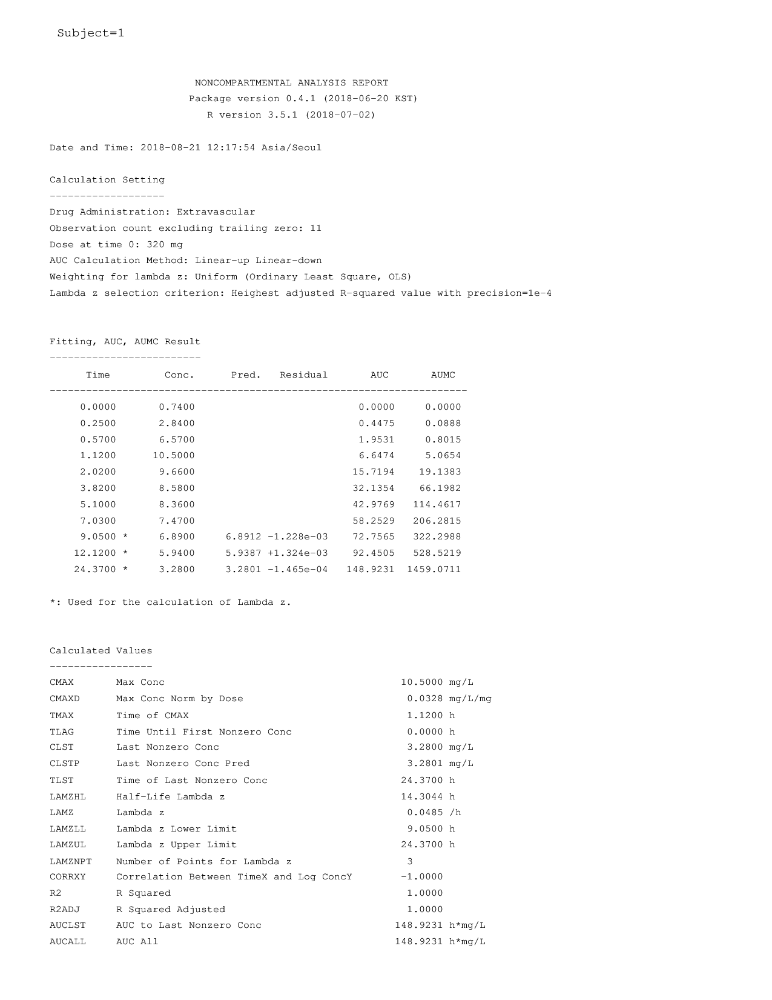
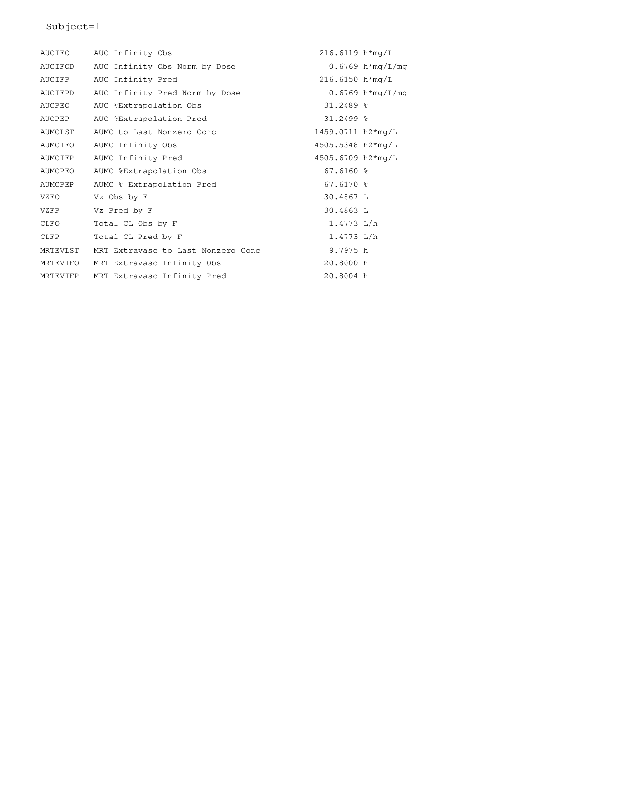

```{r include=FALSE, cache=FALSE}
rm(list = ls(all = TRUE))

pacman::p_load(char = c('knitr', 'tidyverse'))
opts_chunk$set(error = TRUE, 
               out.width = '100%', #results = 'hide',
               #cache = TRUE,
               message = FALSE, warning = FALSE)

```

```{r setup, include = FALSE}
system('cp -r images docs')
if (!require("pacman")) install.packages("pacman")
pacman::p_load("tidyverse", 
			   "BE", "zoo", "psych", "BE", "NonCompart", "pkr", "ncar", 'PKNCA', 'knitr')
pacman::p_install_gh('asancpt/ncarbe')
pacman::p_install_gh('dpastoor/PKPDdatasets')

opts_chunk$set(error = TRUE, 
               out.width = '100%', #results = 'hide',
               cache = TRUE,
               message = FALSE, warning = FALSE)
```

```{r init, include = FALSE}
# options(knitr.table.format = 'html')
# Sys.setlocale('LC_ALL','C')
# detach("package:ncar", unload = TRUE)
# detach("package:pkr", unload = TRUE)
# detach("package:NonCompart", unload = TRUE)
```

# Preface {-}

[](https://github.com/asancpt/book-ncar)


비구획분석은 약물 농도 자료에 간단한 수학식을 적용합니다. 정확한 자료의 생성과 계산을 위해 오류를 줄이는 것이 중요하지만 현재까지 방식은 '재현가능한 연구' 측면에서 분명한 약점이 존재합니다. 이 책은 무료 통계프로그램인 R을 사용하여 정확한 비구획분석을 수행할 수 있는 방법을 제시합니다. 
이러한 방법을 통해 값비싼 상용 소프트웨어를 사용한 결과와 동일한 결과를 얻을 수 있음을 실제 임상시험 자료를 통해 반복적으로 확인하였습니다. 

숫자 계산 뿐만 아니라 시각화도 가능하여 농도-시간 곡선, 용량군 별 파라메터의 forest plot 등의 유용한 그림도 쉽게 그릴 수 있습니다.
CDISC SDTM 표준을 따르는 용어를 사용한 것도 큰 장점입니다.
비구획분석 후 생물학적동등성을 평가할 수 있는 패키지도 함께 개발되었습니다.

한번 익혀두면 속도와 연속성 측면에서 커다란 잇점이 있음을 것을 발견할 수 있을 것입니다. 
또한 재현가능한 연구를 보다 수월하게 구현할 수 있습니다.
무엇보다 무료로 사용할 수 있는 R기반의 공개 소프트웨어라는 점에서 학교, 연구소, 정부기관, 제약회사 등에서 라이센스 등의 제약 없이 손쉽게 설치하고 실행할 수 있으리라 생각됩니다.
책에 대한 피드백, 오탈자 신고 등은 [깃허브 저장소](https://github.com/asancpt/book-ncar/issues)에 남겨주십시오.

감사합니다.

`r Sys.Date()`  
대표저자 배균섭   
서울아산병원 임상약리학과, 울산대학교 임상약리학교실

## 저자소개 {-}

*배균섭*  
서울아산병원 임상약리학과 과장, 울산대학교 의과대학 임상약리학교실 교수입니다. 수십편의 논문을 저술하였고 20년 이상의 프로그래밍 경력을 갖고 있습니다.

*한성필*  
가톨릭의대 약리학교실 연구조교수입니다. 부산대학교 의학전문대학원을 졸업하였고, 서울아산병원 임상약리학과에서 수련 받았습니다. 

*윤석규*  
현재 공중보건의사로 근무 중입니다. 연세대학교 원주캠퍼스 의과대학을 졸업하였고, 서울아산병원 임상약리학과에서 수련 받았습니다. 

*조용순*  
인제의대 약리학교실 조교수입니다. 중앙대학교 의학전문대학원을 졸업하였고, 서울아산병원 임상약리학과에서 수련 받았습니다. 

*김형섭*  
서울아산병원 임상약리학과 전공의입니다. 고려대학교 의학전문대학원을 졸업하였습니다.

  
이 저작물은 [크리에이티브 커먼즈 저작자표시-비영리-동일조건변경허락 4.0 국제 라이선스](http://creativecommons.org/licenses/by-nc-sa/4.0/) 에 따라 이용할 수 있습니다.

<!-- https://creativecommons.org/choose/?lang=ko -->

**감사의 글**

본 출판물은 2016-2020년도 정부(미래창조과학부)의 재원으로 한국연구재단 첨단 사이언스·교육 허브 개발 사업의 지원을 받아 수행된 연구입니다 (NRF-2016-936606).

\mainmatter


<!--chapter:end:index.Rmd-->

```{r include=FALSE, cache=FALSE}
rm(list = ls(all = TRUE))

pacman::p_load(char = c('knitr', 'tidyverse'))
opts_chunk$set(error = TRUE, 
               out.width = '100%', #results = 'hide',
               #cache = TRUE,
               message = FALSE, warning = FALSE)

```
# 비구획 분석이란 {#introduction}

## 이 장에서는 {#summary-introduction}

약동학과 비구획 분석에 대해 간략히 알아보겠습니다.

## 약동학 {#PK-introduction}

인체에 약물이 들어올 때, 약물의 양과 효과는 관련성이 있습니다. 
따라서 약물의 효과를 파악하기 위해 우리 몸에서 약물이 가지는 약동학적 특성을 파악하는 것은 중요합니다.
다양한 신약 개발 과정에서 이러한 약동학적 특성을 파악하여, 약물의 개발을 지속하거나 중지하기도 하며, 마취통증의학과나 내과 등의 다양한 임상 의학에서도 신체에 중요 영향을 미칠 수 있는 약물에 대하여 대략적인 농도를 파악하기 위해 약물의 약동학적 특성을 이용합니다.

약동학적 약물의 특성은 간단하게 ADME라는 용어로 설명할 수 있습니다. 
이는 absorption (흡수), distribution (분포), metabolism (대사), excretion (배설)을 의미합니다. 
약물이 다양한 경로 (경구제 복용, 피하 주사, 정맥 주사, 근육 주사 등)를 통해 우리 몸에 들어오게 되면, 정맥주사 이외의 나머지는 흡수 (absorption)의 과정을 거쳐 우리 몸의 정맥에 분포하게 되며, 이러한 약물은 분포 (distribution)와 제거 (metabolism) 과정에서 감소하게 되고, 제거 과정은 우리 몸에 투여된 물질이 여러 기관 (organ)을 통해서 다른 물질로 변하여 (metabolism) 제거되거나 물질이 변화하지 않고 그대로 배설 (excretion) 되는 과정으로 진행되게 됩니다. 
이러한 수치들은 각각 약물의 농도가 증가하고 감소하는 과정과 밀접하게 연관되어 있으며, 이러한 과정들을 정량화하여 식을 세울 수 있다면, 약물을 투여한 이후의 농도를 보다 정확하게 예측할 수 있습니다. 
이 때 흡수와 관련된 지표로는 흡수속도 상수 (absorption rate constant)와 생체이용률 (bioavailability), 분포, 제거와 관련된 지표로는 분포용적 (Volume of distribution)과 청소율 (Clearance)을 이용하게 되며, 다음 값들을 정확하게 예측하는 것이 약동학 분야에서의 핵심 중의 하나라고 볼 수 있습니다.

이러한 지표들을 구하기 위해서 현재 여러가지 방법들을 사용하고 있으며, 그 중 가장 간단하고도 객관적이며 널리 쓰이는 방법은 비구획분석 (Non-compartmental analysis, NCA)으로 *미국의 FDA (Food and Drug Administration)에서는 NCA 계산을 하는 소프트웨어를 규정하고 있지 않아*, 상용 소프트웨어를 사용하지 않고 약동학적 지표를 구하는 것을 허용하고 있습니다.
따라서 무료로 누구나 사용할 수 있는 R 패키지를 사용하여 주어진 시간과 농도로부터 비구획 분석 방법으로 약동학적 주요 지표를 직접 구해보고자 합니다.

- NonCompart [@R-NonCompart]
- pkr [@R-pkr]
- ncar [@R-ncar]

## 비구획 분석 이론 및 계산 방법 {#ncar-method}

비구획 분석이란 시간, 농도가 표현되어 있는 곡선에서 아무런 가정을 하지 않고 분석하는 것을 의미합니다. 
이때 다음과 같은 가정을 통해서 최대농도 (C~max~) 및 최대농도에 도달하는 시간 (T~max~), 전체 시간-농도 곡선의 면적 (Area under the time-concentration curve, AUC)등을 구하게 됩니다. 
이를 통해 측정된 지표들을 통하여 약물의 특성을 파악하고 특정구간에서의 농도를 예측하게 됩니다. 
비구획 분석에서는 statistical moment theory (단순히 하나의 분자가 우리 몸에 들어와서 제거되지 까지는 예측하는 것이 힘들지만 그 개개의 분자들의 양이 늘어날수록 그들의 전반적인 행동이 규칙적으로 이루어진다는 이론)를 가정하고 이를 통해 우리는 각각의 분자가 우리 몸에서 얼마나 머무는지에 대한 평균값을 예상할 수 있게 됩니다. 
이 시간을 MRT (mean residence time)이라고 지칭하게 되며, 이것은 농도와 시간의 곱을 적분한 값에서 단순 농도 값을 적분한 농도를 나누어 준 값으로 다음과 같이 표현해 줄 수 있습니다. (Equation \@ref(eq:mrt))
\begin{equation}
  MRT = \frac{AUMC}{AUC} = \frac{\int_{0}^{\infty} t \cdot C(t) dt}{\int_{0}^{\infty} C(t) dt}
(\#eq:mrt)
\end{equation}

이때 식에서 표현된 AUMC는 area under the first moment curve로 농도와 시간의 곱을 시간에 대해서 적분한 값에 해당하며 AUC는 area under concentration으로 농도를 시간에 대해 적분한 값에 해당합니다. 
하지만 이 때, 각각의 약물에서 농도와 시간 사이의 명확한 함수관계를 확인할 수 없고, 주어진 정보도 제한적이므로 농도를 시간으로 적분하기에는 상당한 어려움이 따릅니다.
따라서 이를 간소화 하기 위해 Linear trapezoidal method(농도-시간 곡선에서 농도를 측정한 점과 점 사이의 면적을 사다리꼴이라 가정하고 넓이를 구하는 방식)를 사용하게 됩니다.
처음 농도를 측정한 부분부터 마지막 샘플까지를 t~1~,t~2~ …t~last~로 표현했을 시 t~1~과 t~2~의 사이의 AUC와 AUMC는 다음과 같이 계산됩니다. ^[이 수식은 `NonCompart::AUC()` 함수에서 계산 되게 됩니다.]
\begin{equation}
\begin{split}
  AUC_{t_1-t_2} & = 
    (t_2-t_1)\cdot \frac{C_2+C_1}{2} \\
  AUMC_{t_1-t_2} & = 
    (t_2-t_1)\cdot \frac{t_2 \cdot C_2 + t_1 \cdot C_1}{2}
\end{split}
(\#eq:auc-aumc)
\end{equation}

이 방식을 계속 이용하여 각각의 구간 값의 합을 모두 더한 값으로 AUC~last~(처음 농도를 측정하기 시작한 구간부터 마지막 농도를 측정한 구간까지 linear trapezoidal method를 통해서 값을 계산한 방식), AUMC~last~(처음 농도를 측정하기 시작한 구간부터 마지막 농도를 측정한 구간까지 linear trapezoidal method를 통해서 값을 계산한 방식)를 측정해 주게 됩니다. (그림 \@ref(fig:trapezoid))

```{r trapezoid, fig.cap = 'Linear trapezoidal method'}
knitr::include_graphics('assets/trapezoidal.png')
```

추가적으로 마지막으로 농도를 잰 시점에서 모든 약물이 우리 몸에서 빠져나가는 시점까지의 값을 구하기 위해서 마지막으로 측정한 점의 기울기가 그대로 약물이 모두 제거되는 시점까지 그대로 유지된다는 가정을 세우게 됩니다.
다음과 같이 C~last~(가장 마지막으로 농도를 측정한 시점)에서 λ (C~max~ 이후에 선형성이 가장 높은 3점을 선택하여 구한 기울기)를 구한 후 다음과 같은 약동학 공식을 대입하여 값을 구해주게 됩니다.
\begin{equation}
\begin{split}
AUC_{t_{last}-\infty} = 
  \frac{C_{last}}{\lambda} \\
AUMC_{t_{last}-\infty} = 
  \frac{t_{last} \cdot C_{last}}{\lambda} + 
  \frac{C_{last}}{\lambda^2}
\end{split}
(\#eq:terminal-slope)
\end{equation}

약물이 우리 몸에 들어온 후 가장 높은 농도의 경우 실제 개개인에서 농도를 측정한 값들 중 가장 높은 농도를 실제 가장 높은 농도라 가정하여 사용하게 되고, 이 지표를 C~max~라 부릅니다. 또한 이때의 시점을 T~max~라 부르게 됩니다.
위에서 구한 AUC와 C~max~, λ 를 가지고 나머지 주요 값을 계산하게 됩니다.
이 중 청소율(제거되는 속도)에 해당하는 clearance(일반적으로 CL이라 지칭한다.) 의 경우 다음의 약동학 기본 공식을 활용하여 구해주게 됩니다.
\begin{equation}
CL = \frac{D \cdot F}{AUC}
(\#eq:clearance)
\end{equation}

수식에서 D는 dose로 투여량을, F는 생체이용률을 의미합니다.

우리 몸의 분포 (disposition)을 알기 위해 우리 몸의 volume을 나타내는 volume of distribution at steady state (Vdss)는 아래 식을 이용하여 값을 구하게 됩니다. 

$$
Vd_{ss} = MRT \cdot CL = \frac{AUMC}{AUC} \cdot \frac{D}{AUC}
$$

우리 몸의 생체이용률을 나타내는 F의 경우 기본적으로 정맥주사시의 생체이용률을 1이라고 가정하고, 다음 식으로 구합니다.

$$
F = \frac{D_{iv}}{D_{oral}} \cdot \frac{AUC_{oral}}{AUC_{iv}}
$$

(이중 Div는 정맥주사 투여량, Doral은 경구 투여량, AUCoral은 경구 투여에서의 AUC, AUCiv는 정맥투여에서의 AUC를 의미한다.
이처럼 AUC, C~max~, AUMC, λ 를 구하는 부분에 있어서는 non-compartmental analysis의 기본 가정들을 활용하였고 그 밖의 부분들에서는 현재 정형화된 공식들을 활용하여 적용하였다. 
위 내용을 바탕으로 R을 기반으로 한 script를 구성한 후 전세계적으로 널리 쓰이고 있는 CDISC terminology를 각각의 지표들에 적용하여 결과값을 도출하였다. 

또한 투여되는 방식을 3가지 분류(Extravascular, IV infusion, IV bolus)로 구분하여, 그에 맞는 각각의 식을 적용하였다. 
마지막으로 시간당 농도의 변화율이 농도 증가 곡선보다 감소 곡선에서 완만하다는 점을 고려하여 농도가 감소하는 구간에서는 log값을 선택적으로 줄 수 있도록 설정하였으며, 흡수 속도 상수의 경우 현 NCA method를 통해 구하기에는 한계가 있어 따로 값을 제시하지 않았습니다. 

흡수속도 상수를 구하기 위해서는 구획분석방법(compartmental analysis)이나 비선형 혼합모형(non-linear mixed effect modeling)을 사용하는 것이 바람직합니다.
 
Figure 2. Linear trapezoidal method를 적용한 AUC의 계산 Script

Figure 3 약동학 지표들에 대해 각각의 공식을 적용한 Script의 예

## 계산 공식

`C0`: C0 is the initial concentration at the dosing time. It is the observed concentration at the dosing time, if available. Otherwise it is approximated using the following rules. For iv-bolus data, log-linear back-extrapolation (*see "backExtrap" argument*) is performed from the first two observations to estimate C0, provided the local slope is negative. However, if the slope is >=0 or at least one of the first two concentrations is 0, the first non-zero concentration is used as C0. For other types of administration, C0 is equal to 0 for non steady-state data and for steady-state data the minimum value observed between the dosing intervals is used to estimate C0, provided the "backExtrap" argument is set to "yes".

`Cmax, Tmax and Cmax_D`: Cmax and Tmax are the value and the time of maximum observed concentration, respectively. If the maximum concentration is not unique, the first maximum is used. For steady state data, The maximum value between the dosing intervals is considered. Cmax_D is the dose normalized maximum observed concentration.

**Clast and Tlast**  
Clast and Tlast are the last measurable positive concentration and the corresponding time, respectively.

**AUClast**  
The area under the concentration vs. time curve from the first observed to last measurable concentration.

**AUMClast**  
The area under the first moment of the concentration vs. time curve from the first observed to last measurable concentration.

**MRTlast**  
Mean residence time from the first observed to last measurable concentration. For non-infusion models,  
$MRTlast = \frac{AUMClast}{AUClast}$  
For infusion models,  
$MRTlast = \frac{AUMClast}{AUClast}-\frac{TI}{2}$  
where TI is the infusion duration.

**No_points_Lambda_z**  
No_points_Lambda_z is the number of observed data points used to determine the best fitting regression line in the elimination phase.

**AUC_pBack_Ext_obs and AUC_pBack_Ext_pred**  
The percentage of AUC that is contributed by the back extrapolation to estimate C0. The rules to to estimate C0 is given above.

**AUClower_upper**  
The AUC under the concentration-time profile within the user-specified window of time provided as the "AUCTimeRange" argument. In case of empty "AUCTimeRange" argument, AUClower_upper is equal to the AUClast.

**Rsq, Rsq_adjusted and Corr_XY**  
Regression coefficient of the regression line used to estimate the elimination rate constant. Rsq_adjusted is the adjusted value of Rsq given by the following relation.  
$Rsq\_adjusted = 1-\frac{(1-Rsq^2)*(n-1)}{n-2}$  
where *n* is the number of points in the regression line. Corr_XY is the square root of Rsq.

**Lambda_z**  
Elimination rate constant estimated from the regression line representing the terminal phase of the concentration-time profile. The relation between the slope of the regression line and Lambda_z is:  
$Lambda\_z = -(slope)$

**Lambda_lower and Lambda_upper**  
Lower and upper limit of the time values from the concentration-time profile used to estimate Lambda_z, respectively, in case the "LambdaTimeRange" is used to specify the time range.

**HL_Lambda_z**  
Terminal half-life of the drug:  
$HL\_Lambda\_z = \frac{ln2}{\lambda_z}$

**AUCINF_obs and AUCINF_obs_D**  
AUC estimated from the first sampled data extrapolated to ${\infty}$. The extrapolation in the terminal phase is based on the last observed concentration (${Clast_obs}$). The equation used for the estimation is given below.  
$AUCINF\_obs = AUClast+\frac{Clast\_obs}{\lambda_z}$  
AUCINF_obs_D is the dose normalized AUCINF_obs.

**AUC_pExtrap_obs**  
Percentage of the AUCINF_obs that is contributed by the extrapolation from the last sampling time to ${\infty}$.  
$AUC\_pExtrap\_obs = \frac{AUCINF\_obs-AUClast}{AUCINF\_obs}*100\%$

**AUMCINF_obs**  
AUMC estimated from the first sampled data extrapolated to ${\infty}$. The extrapolation in the terminal phase is based on the last observed concentration. The equation used for the estimation is given below.  
$AUMCINF\_obs = AUMClast+\frac{Tlast*Clast\_obs}{\lambda_z}+\frac{Clast\_obs}{\lambda_{z}^2}$

**AUMC_pExtrap_obs**  
Percentage of the AUMCINF_obs that is contributed by the extrapolation from the last sampling time to ${\infty}$.  
$AUMC\_pExtrap\_obs = \frac{AUMCINF\_obs-AUMClast}{AUMCINF\_obs}*100\%$

**Vz_obs**  
Volume of distribution estimated based on total AUC using the following equation.  
$Vz\_obs = \frac{Dose}{\lambda_z*AUCINF\_obs}$

**Cl_obs**  
Total body clearance.
$Cl\_obs = \frac{Dose}{AUCINF\_obs}$

**AUCINF_pred and AUCINF_pred_D**  
AUC from the first sampled data extrapolated to ${\infty}$. The extrapolation in the terminal phase is based on the last predicted concentration obtained from the regression line used to estimate Lambda_z (${Clast\_pred}$). The equation used for the estimation is given below.  
$AUCINF\_pred = AUClast+\frac{Clast\_pred}{\lambda_z}$  
AUCINF_pred_D is the dose normalized AUCINF_pred.

**AUC_pExtrap_pred**  
Percentage of the AUCINF_pred that is contributed by the extrapolation from the last sampling time to ${\infty}$.  
$AUC\_pExtrap\_pred = \frac{AUCINF\_pred-AUClast}{AUCINF\_pred}*100\%$

**AUMCINF_pred**  
AUMC estimated from the first sampled data extrapolated to ${\infty}$. The extrapolation in the terminal phase is based on the last predicted concentration obtained from the regression line used to estimate Lambda_z (${Clast\_pred}$). The equation used for the estimation is given below.  

$AUMCINF\_pred = AUMClast+\frac{Tlast*Clast\_pred}{\lambda_z}+\frac{Clast\_pred}{\lambda_{z}^2}$  

**AUMC_pExtrap_pred**  
Percentage of the AUMCINF_pred that is contributed by the extrapolation from the last sampling time to ${\infty}$.  
$AUMC\_pExtrap\_pred = \frac{AUMCINF\_pred-AUMClast}{AUMCINF\_pred}*100\%$  

**Vz_pred**  
Volume of distribution estimated based on total AUC using the following equation.  
$Vz\_pred = \frac{Dose}{\lambda_z*AUCINF\_pred}$  

**Cl_pred**  
Total body clearance.  
$Cl\_pred = \frac{Dose}{AUCINF\_pred}$

**MRTINF_obs**  
Mean residence time from the first sampled time extrapolated to ${\infty}$ based on the last observed concentration (${Clast\_obs}$).  
For non-infusion non steady-state data:  
$MRTINF\_obs = \frac{AUMCINF\_obs}{AUCINF\_obs}$  
For infusion non steady-state data:  
$MRTINF\_obs = \frac{AUMCINF\_obs}{AUCINF\_obs}-\frac{TI}{2}$  
where ${TI}$ is the infusion duration. For non-infusion steady-state data:  
$MRTINF\_obs = \frac{AUMCINF\_obs|_{0}^{\tau}+\tau*(AUCINF\_obs-AUC|_{0}^{\tau})}{AUCINF\_obs|_{0}^{\tau}}$  
For infusion steady-state data:  
$MRTINF\_obs = \frac{AUMCINF\_obs|_{0}^{\tau}+\tau*(AUCINF\_obs-AUC|_{0}^{\tau})}{AUCINF\_obs|_{0}^{\tau}}-\frac{TI}{2}$  
For steady-state data ${\tau}$ represents the dosing interval.

**MRTINF_pred**  
Mean residence time from the first sampled time extrapolated to ${\infty}$ based on the last predicted concentration obtained from the regression line used to estimate Lambda_z (${Clast\_pred}$).  
For non-infusion non steady-state data:  
$MRTINF\_pred = \frac{AUMCINF\_pred}{AUCINF\_pred}$  
For infusion non steady-state data:  
$MRTINF\_pred = \frac{AUMCINF\_pred}{AUCINF\_pred}-\frac{TI}{2}$  
where ${TI}$ is the infusion duration.  
For non-infusion steady-state data:  
$MRTINF\_pred = \frac{AUMCINF\_pred|_{0}^{\tau}+\tau*(AUCINF\_pred-AUC|_{0}^{\tau})}{AUCINF\_pred|_{0}^{\tau}}$  
For infusion steady-state data:  
$MRTINF\_pred = \frac{AUMCINF\_pred|_{0}^{\tau}+\tau*(AUCINF\_pred-AUC|_{0}^{\tau})}{AUCINF\_pred|_{0}^{\tau}}-\frac{TI}{2}$  
For steady-state data ${\tau}$ represents the dosing interval.

**Vss_obs and Vss_pred**  
An estimate of the volume of distribution at steady-state.  
$Vss\_obs = MRTINF\_obs*Cl\_obs$  
$Vss\_pred = MRTINF\_pred*Cl\_pred$  

**Tau**  
The dosing interval for steady-state data. This value is assumed to be the same over multiple doses.

**Cmin and Tmin**  
Cmin is the minimum concentration between 0 and Tau and Tmin is the corresponding time for steady-state data.

**Cavg**  
The average concentration between 0 and Tau for steady-state data.  
$Cavg = \frac{AUC|_{0}^{Tau}}{Tau}$

**p_Fluctuation**  
Percentage of the fluctuation of the concentration between 0 and Tau for steady-state data.  
$p\_Fluctuation = \frac{Cmax-Cmin}{Cavg}*100\%$

**Accumulation_Index**  
$Accumulation\_Index = \frac{1}{1-e^{-\lambda_{z}*\tau}}$  

**Clss**  
An estimate of the total body clearance for steady-state data.  
$Clss = \frac{Dose}{AUC|_{0}^{\tau}}$


<!--chapter:end:01.Rmd-->

```{r include=FALSE, cache=FALSE}
rm(list = ls(all = TRUE))

pacman::p_load(char = c('knitr', 'tidyverse'))
opts_chunk$set(error = TRUE, 
               out.width = '100%', #results = 'hide',
               #cache = TRUE,
               message = FALSE, warning = FALSE)

```
# R과 그 패키지에 대하여 {#R-and-packages}

## 이 장에서는 {#summary-r-packages}

R [@R-base]은 통계 소프트웨어 입니다. 
비구획분석을 R로 수행하는 가장 중요한 이유는 오류를 줄일 수 있고, 한번 설정한 것을 반복해서 적용하는 것이 쉽기 때문입니다.
이 책에서 주로 다루게 될 `NonCompart` [@R-NonCompart],  `ncar` [@R-ncar], `pkr` [@R-pkr] 은 비구획 분석을 R을 통해 쉽고 빠르게 행할 수 있는 R 패키지입니다.

`NonCompart`의 패키지 제목은 `r packageDescription("NonCompart")$Title`, 
`ncar`의 패키지 제목은 `r packageDescription("ncar")$Title`,
`pkr`의 패키지 제목은 `r packageDescription("pkr")$Title` 입니다.

## R에 대하여 {#basic}

굉장히 유용한 소프트웨어이지만 이에 대해 여기서 자세히 설명하긴 힘듭니다. 
R에 대한 많은 책들을 bookdown.org^[https://bookdown.org]에서 무료로 읽을 수 있습니다. 
Coursera^[https://coursera.com]에서 무료 온라인 강의를 들을 수 있습니다.

## 설치 {#install}

우선 R을 설치합니다. 
R은 아래 링크^[https://cran.r-project.org/]에서 다운로드 받을 수 있습니다. 

R을 실행한 후, 콘솔 창에서 비구획분석을 위한 패키지를 설치하는 방법은 다음과 같습니다. 
홑따옴표 등의 인용 부호에 주의하세요.

```r
install.packages('NonCompart')
install.packages('ncar')
install.packages('pkr')
```

설치는 한번만 하면 되지만, 비구획분석을 위해서는 매 세션마다 패키지를 *불러오기*해야 합니다.

```r
library(NonCompart)
library(ncar)
library(pkr)
```

## 기타 설치 {#otherinstall}

아래 두 패키지는 비구획분석과는 관계없지만 자료 처리 혹은 그림 등을 그리는데 도움을 줍니다. 

```r
library(ggplot2) 
library(dplyr) 
library(knitr) 
```

도움이 필요할때는 맨 앞에 물음표를 붙여서 콘솔창에 입력하거나 `help()` 함수를 사용합니다.

```r
?NonCompart
help(tblNCA)
```

자료 분석을 위해 몇가지 도구가 필요한데 `tidyverse`[@R-tidyverse]를 설치하면 다수의 편리한 패키지 `tidyr` [@R-tidyr], `dplyr` [@R-dplyr], `tibble` [@R-tibble], `ggplot2` [@R-ggplot2], `purrr` [@R-purrr], `readr` [@R-readr]의 설치와 불러오기 과정을 쉽게 끝낼 수 있습니다. 

다만 비구획분석을 위한 함수의 입력을 위해 `tibble` 형식은 `as.data.frame()`을 통하여 데이타프레임으로 자료 형식을 변환하는 것이 좋습니다.
마찬가지로 `readr` 패키지의 `read_csv()` 명령어를 쓸 경우 `tibble`로 읽혀지기 때문에 `as.data.frame()`으로 바꿔주거나 처음부터 `read.csv()`를 쓰는 것을 고려할 수 있습니다. 

```r
install.packages('tidyverse')
library(tidyverse)
```

<!--chapter:end:02.Rmd-->

```{r include=FALSE, cache=FALSE}
rm(list = ls(all = TRUE))

pacman::p_load(char = c('knitr', 'tidyverse'))
opts_chunk$set(error = TRUE, 
               out.width = '100%', #results = 'hide',
               #cache = TRUE,
               message = FALSE, warning = FALSE)

```
# R을 사용한 비구획분석 {#noncompart}

## 이 장에서는 {#summary-noncompart}

`NonCompart` [@R-NonCompart]은 비구획 분석을 R을 통해 쉽고 빠르게 (매우 빠르게) 행할 수 있는 패키지입니다. 
약동학 교재의 내용을 충실히 반영하였습니다. [@gab; @tozer]
이에 대해 좀더 자세히 알아보겠습니다.

`NonCompart`의 `DESCRIPTION` 파일을 보면 다음과 같이 설명하고 있습니다.

> `r packageDescription('NonCompart')$Description`

```{r}
library(tidyverse)
library(NonCompart)
```

## NonCompart 사용법 {#how-to-use}

NonCompart::tblNCA() 함수에는 여러가지 argument가 입력되어 결과 계산에 활용됩니다. 사용법은 다음과 같습니다.

```{r echo = FALSE}
tblNCAarg <- formals(NonCompart::tblNCA)
```

<!---
```r
tblNCA(concData, key = "Subject", colTime = "Time", colConc = "conc", dose = 0, 
       adm = "Extravascular", dur = 0, doseUnit = "mg", timeUnit = "h", 
       concUnit = "ug/L", down = "Linear", R2ADJ = 0.7, MW = 0) # args(NonCompart::tblNCA)
```
--->

`concData`는 데이터셋 이름을 설정합니다. 참고로 `tibble` 형식은 지원하지 않기 때문에  `readr::read_csv()`를 통해 자료를 불러왔다면 `as.data.frame()` 함수 등을 사용하여 `data.frame` 형식으로 변환하여야 합니다. 
`key`는 subject ID의 컬럼명 혹은 treatment code의 컬럼명 (교차시험 등에서)을 벡터 형태로 지정할 수 있습니다. 
`colTime`은 time의 컬럼명, `colConc`는 concentration의 컬럼명 등을 함수 인자로 갖습니다. 그 외 인자들에 대해서 살펴보자면 다음과 같습니다. 

1. `down`
    - AUC와 AUMC를 구하는 trapezoidal method 설정이며, 기본값은 `Linear`입니다.
    - `Linear`와 `Log` 중 선택 가능하며 각각 linear trapezoidal method와 linear-up and log-down method를 의미합니다.
1. `dose`
    - 투여량에 대한 설정입니다. 단위에 주의해야 합니다.  벡터값을 줌으로서 각 대상자별 용량을 다르게 할 수 있습니다.
1. `adm`
    - 투여경로에 대한 설정, 기본값은 "Extravascular"으로 경구 투여 등을 의미합니다.
    - Bolus, Infusion, Extravascular 중에서 선택 가능하다.
1. `dur`
    - 주입하는 기간(infusion duration)을 설정합니다. 기본값은 0입니다.
1. `R2ADJ`
    - `R2ADJ` 값이 설정값 이하인 경우 `DetSlope()`함수에 의해 terminal slope를 수동으로 interactive하게 고를 수 있게됩니다.

이제 약동학 파라미터를 산출하기 위해서는 아래와 같이 하면 됩니다.
우선 `Theoph` (theophylline) 의 약동학 파라미터를 구해보겠습니다.

```{r}
Theoph_nca <- tblNCA(Theoph, "Subject", "Time", "conc", 
                     dose=320, concUnit="mg/L")
Theoph_nca
```

여기서 `dose=320`으로 되었다는 것은 아미노필린 400mg 투여시 테오필린 320mg이 경구로 투여되었음을 의미합니다.

```{r include = FALSE}
save(Theoph_nca, file = 'data/Theoph_nca.Rdata')
```

이는 문자(character)로 구성된 matrix로 구성된 결과물과 단위 정보가 담긴 attribute를 포함하고 있습니다.

다음으로 Indomethacin 의 약동학 파라미터를 구해보겠습니다. 
이는 IV bolus 이므로 `adm="bolus"` 인자를 정의해야 합니다. 

```{r}
Indometh_nca <- tblNCA(Indometh, "Subject", "time", "conc", 
                       dose=25, adm="Bolus", dur=0.5, concUnit="mg/L", R2ADJ=0.5)
```

```{r, include = FALSE, evel = FALSE}
NonCompartdb <- tools::Rd_db('NonCompart')
tblNcaExample <- sapply(NonCompartdb, tools:::.Rd_get_metadata, 'usage')$tblNCA.Rd %>% .[-1]
paste(tblNcaExample, collapse = '\\n')
```

## 구간 NCA {#interval-NCA}

1. iAUC
    - 일부구간에 대한 AUC를 구하기 위한 구간설정 옵션입니다.
    - "Name", "Start", "End" 3개의 컬럼으로 구성된 데이터 프레임으로 설정해야 합니다.

일부 구간의 AUC를 구하는 방법은 조금 더 복잡하므로 자세히 알아봅시다.
예를 들어 0~12시간까지의 AUC, 0~24시간까지의 AUC를 구하고자 한다면 다음과 같이 하면 됩니다.
먼저 구하고자 하는 구간에 대한 정보를 갖는 변수를 아래와같이 생성합니다.

```{r}
iAUC <- data.frame(Name=c("AUC[0-12h]","AUC[0-24h]"), Start=c(0,0), End=c(12,24))
iAUC
```
        Name Start End
1 AUC[0-12h]     0  12
2 AUC[0-24h]     0  24

이제 iAUC 옵션을 이용해서 이를 구합니다.

```r
# tblNCA(Theoph, "Subject", "Time", "conc", dose=320, iAUC=iAUC)
```

맨 마지막 파라미터로 AUC[0-12h], AUC[0-24h]가 추가되었음을 알 수 있습니다.

개인별 일부 구간의 AUC를 구하는 방법은 아래와 같다.
예를 들어 0~12시간까지의 AUC, 0~24시간까지의 AUC를 구하고자 한다면 다음과 같이 하면 된다.

```r
iAUC = data.frame(Name=c("AUC[0-12h]","AUC[0-24h]"), Start=c(0,0), End=c(12,24)) ; iAUC
```

        Name Start End
1 AUC[0-12h]     0  12
2 AUC[0-24h]     0  24


```r
#IntAUC
#IntAUC(Theoph[Theoph$Subject==1,"Time"], Theoph[Theoph$Subject==1, "conc"], Dose=320, iAUC=iAUC)
```


## 함수 살펴보기 {#functions}

NonCompart 패키지 내의 여러가지 함수를 살펴보겠습니다. `r paste0(paste0(ls('package:NonCompart'), '()'), collapse = ', ')`라는 함수가 있습니다.

### AUC

AUC와 AUMC를  'Linear trapezoidal method' 혹은 'linear-up and log-down method'의 두가지 방식으로 계산하게 됩니다.

```{r}
AUC(Theoph[Theoph$Subject==1, "Time"], Theoph[Theoph$Subject==1, "conc"])
AUC(Theoph[Theoph$Subject==1, "Time"], Theoph[Theoph$Subject==1, "conc"], down="Log")
```

## 긴 형식으로 변환하면서 단위 추가하기 {#long-format}

NonCompart 패키지의 tblNCA()함수를 사용해서 비구획분석 결과를 내면 attr로 names와 units를 등일 갖게 됩니다. 이를 long format의 tidy data로 변환하는 방법은 다음과 같습니다.

```{r}
left_join(as_tibble(Theoph_nca) %>% 
            gather(PPTESTCD, PPORRES, -Subject),
          tibble(PPTESTCD = attributes(Theoph_nca)$names,
                 UNIT = attributes(Theoph_nca)$units)) %>% 
  arrange(PPTESTCD)
```


<!--chapter:end:03-noncompartmental.Rmd-->

```{r include=FALSE, cache=FALSE}
rm(list = ls(all = TRUE))

pacman::p_load(char = c('knitr', 'tidyverse'))
opts_chunk$set(error = TRUE, 
               out.width = '100%', #results = 'hide',
               #cache = TRUE,
               message = FALSE, warning = FALSE)

```
# R을 사용한 비구획분석 {#noncompart}

## 이 장에서는 {#summary-noncompart}

`NonCompart` [@R-NonCompart]은 비구획 분석을 R을 통해 쉽고 빠르게 (매우 빠르게) 행할 수 있는 패키지입니다. 
약동학 교재의 내용을 충실히 반영하였습니다. [@gab; @tozer]
이에 대해 좀더 자세히 알아보겠습니다.

`NonCompart`의 `DESCRIPTION` 파일을 보면 다음과 같이 설명하고 있습니다.

> `r packageDescription('NonCompart')$Description`

```{r}
library(tidyverse)
library(NonCompart)
```

## NonCompart 사용법 {#how-to-use}

tblNCA의 사용법은 다음과 같습니다.

```{r echo = FALSE}
args(NonCompart::tblNCA)
```

<!---
```r
tblNCA(concData, key = "Subject", colTime = "Time", colConc = "conc", dose = 0, 
       adm = "Extravascular", dur = 0, doseUnit = "mg", timeUnit = "h", 
       concUnit = "ug/L", down = "Linear", R2ADJ = 0.7, MW = 0) # args(NonCompart::tblNCA)
```
--->

`concData`는 데이터셋 이름을 설정합니다. 참고로 `tibble` 형식은 지원하지 않기 때문에 
`readr::read_csv()`를 통해 자료를 불러왔다면 `as.data.frame()` 함수 등을 사용하여 `data.frame` 형식으로 변환하여야 합니다. 
`key`는 subject ID의 컬럼명 혹은 treatment code의 컬럼명 (교차시험 등에서)을 벡터 형태로 지정할 수 있습니다. 
`colTime`은 time의 컬럼명, `colConc`는 concentration의 컬럼명 등을 함수 인자로 갖습니다. 그 외 인자들에 대해서 살펴보자면 다음과 같습니다. 

1. `down`
    - AUC와 AUMC를 구하는 trapezoidal method 설정이며, 기본값은 `Linear`입니다.
    - `Linear`와 `Log` 중 선택 가능하며 각각 linear trapezoidal method와 linear-up and log-down method를 의미합니다.
1. `dose`
    - 투여량에 대한 설정입니다. 단위에 주의해야 합니다.  벡터값을 줌으로서 각 대상자별 용량을 다르게 할 수 있습니다.
1. `adm`
    - 투여경로에 대한 설정, 기본값은 "Extravascular"으로 경구 투여 등을 의미합니다.
    - Bolus, Infusion, Extravascular 중에서 선택 가능하다.
1. `dur`
    - 주입하는 기간(infusion duration)을 설정합니다. 기본값은 0입니다.
1. `R2ADJ`
    - `R2ADJ` 값이 설정값 이하인 경우 `DetSlope()`함수에 의해 terminal slope를 수동으로 interactive하게 고를 수 있게됩니다.

이제 약동학 파라미터를 산출하기 위해서는 아래와 같이 하면 됩니다.
우선 Theophylline 의 약동학 파라미터를 구해보겠습니다.

```{r}
Theoph_nca <- tblNCA(Theoph, "Subject", "Time", "conc", 
                     dose=320, concUnit="mg/L")
Theoph_nca
```

여기서 `dose=320`으로 되었다는 것은 아미노필린 400mg 투여시 테오필린 320mg이 경구로 투여되었음을 의미합니다.

```{r include = FALSE}
save(Theoph_nca, file = 'data/Theoph_nca.Rdata')
```

이는 문자(character)로 구성된 matrix로 구성된 결과물과 단위 정보가 담긴 attribute를 포함하고 있습니다.

다음으로 Indomethacin 의 약동학 파라미터를 구해보겠습니다. 
이는 IV bolus 이므로 `adm="bolus"` 인자를 정의해야 합니다. 

```{r}
Indometh_nca <- NonCompart::tblNCA(Indometh, "Subject", "time", "conc", 
                       dose=25, adm="Bolus", dur=0.5, concUnit="mg/L", R2ADJ=0.5)
```

```{r, include = FALSE, evel = FALSE}
NonCompartdb <- tools::Rd_db('NonCompart')
tblNcaExample <- sapply(NonCompartdb, tools:::.Rd_get_metadata, 'usage')$tblNCA.Rd %>% .[-1]
paste(tblNcaExample, collapse = '\\n')
```

## 구간 NCA {#interval-NCA}

1. iAUC
    - 일부구간에 대한 AUC를 구하기 위한 구간설정 옵션입니다.
    - "Name", "Start", "End" 3개의 컬럼으로 구성된 데이터 프레임으로 설정해야 합니다.

일부 구간의 AUC를 구하는 방법은 조금 더 복잡하므로 자세히 알아봅시다.
예를 들어 0~12시간까지의 AUC, 0~24시간까지의 AUC를 구하고자 한다면 다음과 같이 하면 됩니다.
먼저 구하고자 하는 구간에 대한 정보를 갖는 변수를 아래와같이 생성합니다.

```{r}
iAUC <- data.frame(Name=c("AUC[0-12h]","AUC[0-24h]"), Start=c(0,0), End=c(12,24))
iAUC
```
        Name Start End
1 AUC[0-12h]     0  12
2 AUC[0-24h]     0  24

이제 iAUC 옵션을 이용해서 이를 구합니다.

```r
# tblNCA(Theoph, "Subject", "Time", "conc", dose=320, iAUC=iAUC)
```

맨 마지막 파라미터로 AUC[0-12h], AUC[0-24h]가 추가되었음을 알 수 있습니다.

개인별 일부 구간의 AUC를 구하는 방법은 아래와 같다.
예를 들어 0~12시간까지의 AUC, 0~24시간까지의 AUC를 구하고자 한다면 다음과 같이 하면 된다.

```r
iAUC = data.frame(Name=c("AUC[0-12h]","AUC[0-24h]"), Start=c(0,0), End=c(12,24)) ; iAUC
```

        Name Start End
1 AUC[0-12h]     0  12
2 AUC[0-24h]     0  24


```r
#IntAUC
#IntAUC(Theoph[Theoph$Subject==1,"Time"], Theoph[Theoph$Subject==1, "conc"], Dose=320, iAUC=iAUC)
```


## 함수 살펴보기 {#functions}
<!--
NonCompart 패키지 내의 여러가지 함수를 살펴보겠습니다. `r paste0(paste0(ls('package:NonCompart'), '()'), collapse = ', ')`라는 함수가 있습니다.
-->
### AUC

AUC와 AUMC를  'Linear trapezoidal method' 혹은 'linear-up and log-down method'의 두가지 방식으로 계산하게 됩니다.

```{r}
AUC(Theoph[Theoph$Subject==1, "Time"], Theoph[Theoph$Subject==1, "conc"])
AUC(Theoph[Theoph$Subject==1, "Time"], Theoph[Theoph$Subject==1, "conc"], down="Log")
```

## 긴 형식으로 변환하면서 단위 추가하기 {#long-format}

NonCompart 패키지의 tblNCA()함수를 사용해서 비구획분석 결과를 내면 attr로 names와 units를 등일 갖게 됩니다. 이를 long format의 tidy data로 변환하는 방법은 다음과 같습니다.

```{r}
left_join(as_tibble(Theoph_nca) %>% 
            gather(PPTESTCD, PPORRES, -Subject),
          tibble(PPTESTCD = attributes(Theoph_nca)$names,
                 UNIT = attributes(Theoph_nca)$units)) %>% 
  arrange(PPTESTCD)
```


<!--chapter:end:03.Rmd-->

```{r include=FALSE, cache=FALSE}
rm(list = ls(all = TRUE))

pacman::p_load(char = c('knitr', 'tidyverse'))
opts_chunk$set(error = TRUE, 
               out.width = '100%', #results = 'hide',
               #cache = TRUE,
               message = FALSE, warning = FALSE)

```
```{r include=FALSE, cache=FALSE}
rm(list = ls(all = TRUE))
knitr::opts_chunk$set(error = TRUE, 
               out.width = '100%', #results = 'hide',
               cache = FALSE,
               message = FALSE, warning = FALSE)

```
---
output: html_document
editor_options: 
  chunk_output_type: console
---

# R을 사용한 비구획분석 보고서 {#ncar}

## 이 장에서는 {#summary-ncar}

보고서를 일정한 형식으로 작성하여 다른 사람/기관과 공유하는 것은 중요합니다. 이를 `ncar` 패키지를 사용하여 좀더 쉽게 할 수 있습니다.
이 패키지를 통해서 약동학 파라이터를 보고서 형식의 text, pdf, rtf 파일로 저장할 수 있습니다.
이에 대해 좀더 자세히 알아보겠습니다.

`ncar`의 `DESCRIPTION` 파일을 보면 다음과 같이 설명하고 있습니다.

> `r packageDescription('ncar')$Description`


```{r}
library(tidyverse)
library(ncar)
```

## txtNCA()

우선 저장될 폴더를 확인하면 다음과 같습니다.

```{r}
getwd()
```

저장될 폴더를 변경하고자 한다면 setwd("저장될 경로") 이렇게 설정하면 됩니다.

`txtNCA()` 함수를 사용하여 한 대상자에 대한 plain text 보고서를 작성할 수 있습니다.

```{r eval = FALSE}
txtNCA(Theoph[Theoph$Subject=="1","Time"],
       Theoph[Theoph$Subject=="1","conc"], 
       dose=320, doseUnit="mg", concUnit="mg/L", timeUnit="h")
```

또한, Theoph 자료의 약동학 파라미터 분석 결과는 아래와 같이 텍스트파일로 저장할 수 있습니다.

```{r}
writeLines(txtNCA(Theoph[Theoph$Subject=="1","Time"],
                  Theoph[Theoph$Subject=="1","conc"], 
                  dose=320, doseUnit="mg", concUnit="mg/L",
                  timeUnit="h"), 
           'Output-ncar/txtNCA-Theoph.txt')
```

저장된 파일 내용은 아래와 같습니다.

```{bash, code = readLines('Output-ncar/txtNCA-Theoph.txt'), eval = FALSE}
```

한편 `txtNCA2()`를 다음과 같이 정의하면 여러 대상자에 대한 보고서를 작성 가능합니다.

```{r}
txtNCA2 <- function(dataset){
  dataset %>% 
    as_tibble() %>% 
    group_by(Subject) %>% 
    summarise(res = c(ID = glue::glue('ID={unique(Subject)}\n\n'),
                     txtNCA(Time, 
                           conc, 
                           dose=320, 
                           doseUnit="mg", 
                           concUnit="mg/L", 
                           timeUnit="h")) %>% paste(collapse = '\n')) %>%
    .$res %>%
    paste(collapse = '\n\n\n\n\n\n')
}
```

```{r}
txtNCA2(Theoph) %>% writeLines('Output-ncar/txtNCA-group-Theoph.txt')
```

저장된 파일 내용은 Appendix \@ref(theophgroup) 에서 확인 가능합니다.

<!--Indometh의 경우 Appendix \@ref(indomethgroup)-->

## pdfNCA()

pdfNCA()로 pdf로 결과를 볼 수 있습니다. (Figure \@ref(fig:pdfnca-output))

```{r pdfNCA}
ncar::pdfNCA(fileName="Output-ncar/pdfNCA-Theoph.pdf", Theoph, key="Subject", 
             colTime="Time",  colConc="conc", dose=320, doseUnit="mg", 
             timeUnit="h", concUnit="mg/L")
```

```{bash}
magick -density 150 Output-ncar/pdfNCA-Theoph.pdf Output-ncar/pdfNCA-Theoph-%02d.png
magick montage Output-ncar/pdfNCA-Theoph-01.png Output-ncar/pdfNCA-Theoph-02.png Output-ncar/montage.png
```

```{r pdfnca-output, fig.cap = 'pdfNCA() output', fig.width = 6, echo = FALSE}
#
#knitr::include_graphics(c('Output-ncar/pdfNCA-Theoph-01.png', 'Output-ncar/pdfNCA-Theoph-02.png'))
#
knitr::include_graphics('Output-ncar/montage.png')
```

## rtfNCA()

마이크로소프트 워드에서 편집가능한 rtf파일을 만듭니다.

```{r eval = FALSE}
ncar::rtfNCA(fileName="rtfNCA-Theoph.rtf", Theoph, key="Subject", 
             colTime="Time", colConc="conc", dose=320, doseUnit="mg", 
             timeUnit="h", concUnit="mg/L")
```


<!--chapter:end:04.Rmd-->

---
output: html_document
editor_options: 
  chunk_output_type: console
---
```{r include=FALSE, cache=FALSE}
rm(list = ls(all = TRUE))

pacman::p_load(char = c('knitr', 'tidyverse'))
opts_chunk$set(error = TRUE, 
               out.width = '100%', #results = 'hide',
               #cache = TRUE,
               message = FALSE, warning = FALSE)

```

# R을 사용한 비구획분석 시각화 {#pkr}

## 이 장에서는 {#summary-pkr}

비구획분석에 대한 다양한 시각화는 여러 유용한 정보를 제공해 줍니다. 이를 가능하게 해 주는 `pkr` 패키지[@R-pkr]에 대해서  자세히 알아보겠습니다.

`pkr`의 `DESCRIPTION` 파일을 보면 다음과 같이 설명하고 있습니다.

> `r packageDescription('pkr')$Description`

```{r, message = FALSE}
library(tidyverse)
library(pkr)
```

## pkr 사용법 {#pkr-manual}

`pkr` 함수의 가장 핵심적인 기능은 `plotPK()` 함수에 있고 이 함수의 인자는 다음과 같습니다.

```{r}
args(plotPK)
```

`Theoph` 자료를 갖고 그림을 그리는 명령어를 실행해 보겠습니다.

```{r message = FALSE}
plotPK(Theoph, "Subject", "Time", "conc", unitTime="hr", unitConc="mg/L", dose=320)
```

조금 기다린 후 `Output` 폴더를 확인해 보면 세개의 그림 파일이 생성된 것을 알 수 있습니다.

- `r dir('./Output/', pattern = '\\.tiff$', full.names = TRUE) %>% grep(pattern = ' ', value = TRUE) %>% paste(collapse = '\n- ')` 

```{r include = FALSE}
files <- dir('Output', pattern = '\\.png$', full.names = TRUE)
files
```

```{r, echo = FALSE, fig.cap = '평균 약동학 파라메터와 그룹 농도-시간 그림 (선형)'}
knitr::include_graphics(files[1])
```

```{r, echo = FALSE, fig.cap = '평균 약동학 파라메터와 그룹 농도-시간 그림 (로그)'}
knitr::include_graphics(files[2])
```

```{r, echo = FALSE, fig.cap = '평균 약동학 파라메터와 그룹 평균 농도-시간 그림 (로그)'}
knitr::include_graphics(files[3])
```

또한 개개인 별로 여러개의 그림이 담긴 두개의 PDF 파일이 생성되었습니다.

- `r dir('./Output/', pattern = '\\.pdf$', full.names = TRUE) %>% grep(pattern = ' ', value = TRUE) %>% paste(collapse = '\n- ')` 


```{r, echo = FALSE, fig.cap = '약동학 파라메터와 함께 표시되는 농도-시간 그림 (선형)'}
knitr::include_graphics('Output/Individual PK Linear Scale for Theoph.png')
```

```{r, echo = FALSE, fig.cap = '약동학 파라메터와 함께 표시되는 농도-시간 그림 (로그)'}
knitr::include_graphics('Output/Individual PK Log 10 Scale for Theoph.png')
```


<!--chapter:end:05.Rmd-->

```{r include=FALSE, cache=FALSE}
rm(list = ls(all = TRUE))

pacman::p_load(char = c('knitr', 'tidyverse'))
opts_chunk$set(error = TRUE, 
               out.width = '100%', #results = 'hide',
               #cache = TRUE,
               message = FALSE, warning = FALSE)

```
# R을 사용한 약동학 시뮬레이션 {#rsimulation}

## 이 장에서는 {#summary-simulation}


## 시뮬레이션에 대하여 {#sim-about}

TBD

`wnl` 패키지가 CRAN에 올라와 있습니다.

## 시뮬레이션 후 비구획분석 {#sim-nca}

TBD

## 앱을 통해 살펴보는 시뮬레이션 {#sim-app}

샤이니 앱을 통해서 시뮬레이션을 구현할 수 있습니다. Shinyapp: PK Simulation - 1 Comp IV or Oral <https://asan.shinyapps.io/pk1c/>

```{r}
knitr::include_app("https://asan.shinyapps.io/pk1c/") #, height = "600px")
```

### shiny 앱 {#shiny}

웹브라우저를 통해 간단히 비구획분석을 할 수 있는 앱을 개발하였습니다.

- Han, S. (2017) pkrshiny: Noncompartmental Analysis using pkr R package Shiny application. URL: https://asan.shinyapps.io/pkrshiny

그 외 약동학과 관련된 몇가지 shiny 앱도 참고하세요.

- Han, S. (2017) Pharmacokinetic Simulation of one-compartment Models. URL: https://asan.shinyapps.io/pk1c/ 
- Han, S. (2017) caff: Monte Carlo Simulation of Caffeine Shiny application. URL: https://asan.shinyapps.io/caff
- Han, S. (2016) vtdm: Vancomycin TDM Shiny application. URL: https://asan.shinyapps.io/vtdm


<!--chapter:end:06.Rmd-->

```{r include=FALSE, cache=FALSE}
rm(list = ls(all = TRUE))

pacman::p_load(char = c('knitr', 'tidyverse'))
opts_chunk$set(error = TRUE, 
               out.width = '100%', #results = 'hide',
               #cache = TRUE,
               message = FALSE, warning = FALSE)

```
# 통계처리 {#statistics}

## 이 장에서는 {#stat-intro}

생물학적 동등성, 용량 비례성을 확인하는 통계 처리 방법을 알아보겠습니다.

```{r, message = FALSE}
library(tidyverse)
library(BE)
library(psych)
```

## 기술통계량 구하기 {#stat-desc}

앞서 \@ref(noncompart)장에서 구한 `Theoph_nca`를 갖고 기술 통계량 (평균, 표준편차, 최소값, 최대값, skewness, kurtosis)을 구해보겠습니다. `psych::describe()` 함수를 사용하면 간단히 구할 수 있습니다. 

```{r include = FALSE}
load('data/Theoph_nca.Rdata')
```

```{r}
desc_stat_Theoph_nca <- describe(Theoph_nca) %>% 
  select(n, mean, sd, min, max, skew, kurtosis)

knitr::kable(desc_stat_Theoph_nca, digits = 2)
```

## 생물학적 동등성 {#bioequivalence}

생물학적 동등성을 위한 가장 간단한 방법은 `BE` 패키지[@R-BE]를 쓰는 것입니다.  

Chow와 Liu의 책의 내용을 충실히 반영하였습니다. [@chow2009design]
생물학적 동등성을 위한 수학 식은 다음과 같습니다. \@ref(eq:be)

$$
\begin{align}
  0.8 < 90\%\ CI\ of\ \frac{GM(AUC_{last, test})}{GM(AUC_{last, ref})} < 1.25 \\
  0.8 < 90\%\ CI\ of\ \frac{GM(AUC_{last, test})}{GM(AUC_{last, ref})} < 1.25 (\#eq:be)
\end{align}
$$

현재로서는 2x2 디자인의 간단한 임상시험 디자인만을 지원하고 있습니다. (그림 \@ref(fig:twobytwo))
핵심이 되는 함수는 `beNCA()` 입니다. 

```{r twobytwo, fig.cap = '전형적인 2x2 설계'}
knitr::include_graphics('assets/twobytwo.jpg')
```

```{r echo = FALSE}
args(BE::be2x2)
```

다음과 같은 함수 인자를 설정해 주면 됩니다.

- SUBJ: Subject ID, any data type
- GRP: column name in which information of "RT" or "TR" exists.
- PRD: column name in which information of 1 or 2 exists.
- TRT: column name in which information of "R" or "T" exists.
- method: `kbe` by authors or `nlme` package uploaded on CRAN

ncarbe 패키지 내에 있는 자료를 사용할 것입니다. (Table \@ref(tab:beconcdata))

```{r}
file <- system.file('example', 'beConc.csv', package = 'ncarbe')
concData <- read_csv(file)
```

```{r beconcdata, echo = FALSE}
knitr::kable(BE::NCAResult4BE, caption = 'A example dataset for the bioequivalence test.')
```

배균섭 교수님의 강의 자료에서 가져왔습니다.

```{r}
print(be2x2(NCAResult4BE, c("AUClast", "Cmax", "Tmax")), na.print="") 
```


```{r fixedrandom, fig.cap = '모수 인자와 변량 인자의 비교'}
knitr::include_graphics('assets/fixed-random.jpg')
```


## Dose Proportionality {#dp}

DP 처리.


16명의 C~max~와 AUC~last~가 나온 표입니다. Table \@ref(tab:sad-pk)


```{r, sad-pk}
# setup ----

library(readxl)
library(tidyverse)
library(broom)

dp_data <- # Virtual data from 4 dose groups (N=16)
'Dose,Subject,Cmax,AUClast
50,101,860,2000
50,102,510,2300
50,103,620,2900
50,104,540,2400
100,201,1550,6600
100,202,1440,7400
100,203,2000,7300
100,204,1600,7000
200,301,4100,20400
200,302,2800,9500
200,303,3200,8000
200,304,2550,7070
400,401,4800,22000
400,402,5700,23000
400,403,5800,26700
400,404,5760,28884'

sad_indi_pk <- read_csv(dp_data)
knitr::kable(sad_indi_pk, caption = '16명의 C~max~, AUC~last~')
```


그림을 살펴보겠습니다.

```{r sad-indi-pk-log}
sad_indi_pk_log <- sad_indi_pk %>% mutate_all(log)

figA <- ggplot(sad_indi_pk_log, aes(x=Dose, y=Cmax)) +
  geom_smooth(method = 'lm')+
  geom_boxplot(aes(group = Dose), 
               size = 1, 
               outlier.colour = "red", 
               outlier.shape = 1, 
               outlier.size = 3) +
  theme_bw() +
  scale_x_continuous(breaks = c(50, 100, 200, 400)) +
  labs(x = 'Dose (mg)', y = expression('C'[max]*' (ng/mL)'),
       title = expression('C'[max]))
figA

figB <- ggplot(sad_indi_pk_log, aes(x=Dose, y=AUClast)) +
  geom_smooth(method = 'lm')+
  geom_boxplot(aes(group = Dose), 
               size = 1, 
               outlier.colour = "red", 
               outlier.shape = 1, 
               outlier.size = 3) +
  theme_bw() +
  scale_x_continuous(breaks = c(50, 100, 200, 400)) +
  labs(x = 'Dose (mg)', y = expression('AUC'[(0-last)]*' (ng·hr/mL)'),
       title = expression('AUC'[(0-last)]))
figB
```

lm() 함수를 써서 구할 수 있습니다.

```{r}
calc_dp <- function(param, fit) {
  bind_cols(fit %>% summary %>% tidy %>% filter(term == 'Dose') %>% select(1, 'estimate', 'std.error'), 
            fit %>% confint(level = 0.95) %>% tidy %>% filter(.rownames == 'Dose'), 
            fit %>% summary %>% glance
            ) %>% 
    filter(term == 'Dose') %>% 
    select(-.rownames, -term) %>% 
    mutate(parameters = param) %>% 
    mutate(est = sprintf('%0.2f (%0.2f)', estimate, std.error)) %>% 
    mutate(ci = sprintf('%0.2f-%0.2f', X2.5.., X97.5..)) %>% 
    select(parameters, est, ci, r.squared, p.value)
}

fit_cmax <- lm(formula = Cmax ~ Dose, data = sad_indi_pk_log)
fit_auclast <- lm(formula = AUClast ~ Dose, data = sad_indi_pk_log)

bind_rows(calc_dp(param = 'Cmax', fit = fit_cmax),
          calc_dp(param = 'AUClast', fit = fit_auclast))
```

C~max~는 dose proportionality 기준을 만족하는데 반해 AUC~last~는 만족하지 않는 것을 알 수 있습니다.


<!--chapter:end:07.Rmd-->

```{r include=FALSE, cache=FALSE}
rm(list = ls(all = TRUE))

pacman::p_load(char = c('knitr', 'tidyverse'))
opts_chunk$set(error = TRUE, 
               out.width = '100%', #results = 'hide',
               #cache = TRUE,
               message = FALSE, warning = FALSE)

```
# 결론 {#conclusion}

R을 통해서 NCA 를 구할 수 있도록 R 패키지를 구축하였습니다. 값비싼 상용소프트웨어를 사용하지 않고도 동일한 비구획분석이 가능한 것은 비용과 작업 효율 측면에서 큰 잇점을 가져올 것입니다.

현재 R에 기본적으로 내장되어 있는 PO 테오필린(theophylline)과 IV bolus 인도메타신(indomethacin)에 대해서 예가 잘 나와있습니다.
약물에 대한 자료를 고른 후 각 약물의 복용량, 감소 구간에서의 log 치환 여부, 복용방법, 정맥주사일 경우 투입 시간(정맥주사 이외의 값들 경우에는 infusion time은 내부 함수에 따라 값이 적용되지 않는다.)을 각각 설정할 경우 값을 도출할 수 있습니다.
 
Edison 내에서 실제 Theophylline의 용량에 따라 구현된 각각의 graph를 spaghetti plot형태로 Edison의 결과 가시화 tab을 이용하여 확인할 수 있으며, 그래프의 형태를 변형할 수 있게 설정하였다. 
Y축(농도)의 경우 linear plot과 semi-logarithmic plot을 모두 함께 확인할 수 있도록 하여 다양한 구간에서의 그래프의 추세를 선택적으로 확인할 수 있도록 하였다.
 
언급하였던 공식 이외에도 Pharmacokinetic and Pharmacodynamic Data Analysis 5th edition 에 언급된 공식을 적용하여 다음과 같이 값을 도출하였다.(figure 8) 

또한 결과 값이 모두 도출된 이후 실제 NCA program으로 가장 흔히 사용되고 있는 WinNonlin® (Version 7.0  Pharsight, CA, USA) software 와의 결과 비교에서도 모든 조건을 현재 Edison simulator에서 준 값과 동일하게 설정하여 프로그램을 실행할 경우, 모든 지표에서 같은 값이 계산됨을 확인하였다. (figure 8, figure 9)
 
현재 가장 간단한 분석 방식인 비구획 분석을 통해서 약동학 분석에 필수적인 지표들을 산출해 내었지만, 마찬가지로 수학적 원리를 반영하여 R script를 구성한다면 보다 고차원적적 약동학 분석 방법인 구획 분석(Compartmental analysis)과 비선형적 약동학(nonlinear mixed effect modeling) 분석 또한 실시할 수 있다. 

실제로 Edison 사이언스 엡에 추가한 'NONMEM(Nonlinear mixed effect modeling), method' 라는 엡을 통해 현재 입력 되어있는 Theoph(theophylline)의 시간 농도 데이터를 가지고 FO(first-order method), FOCE(first-order conditional estimation method), LAPL(Laplace's method)의 방법을 이용하여 현재 사용하는 NONMEM software와 유사한 값들을 재현해 낼 수 있다. 

<!--
Figure 4 논문 내에서의 설정 값 

Figure 5. 앞서 설정한 Theophylline에 대한 linear spaghetti plot
 
Figure 6. 앞서 설정한 Theophylline에 대한 scatter plot
 
Figure 7. 앞서 설정한 Theophylline에 대한 semi-logarithmic spaghetti plot

Figure 8. 앞서 설정한 Theophylline에 대한 NCA 분석 결과
 
Figure 9. Theophylline에 대하여 같은 data와 설정값으로 계산한 WinNonlin® (Version 7.0  Pharsight, CA, USA) software의 결과

Figure 10. NONMEM(Nonlinear mixed effect modeling), method 엡에 입력되어 있는 theophylline data의 농도 시간 곡선
 
Figure 11. theophylline data에 대한 model
 
Figure 12. nonlinear mixed effect modeling First order method를 통해 도출된 parameter
-->

---

약물을 연구하고 개발하는데 있어서 약동학은 굉장히 필수적인 분야이며, 그 동안 이러한 약동학 지표들을 구하기 위해서 그러한 결론이 도출되는 과정을 고려하지 않고 일부 프로그램의 사용에만 의존하는 모습이 주를 이뤘습니다.

하지만 이번 Edison program과 다양한 수학적, 통계적 지식을 coding에 활용하여 실제 임상적으로도 활용 가능한 결과값을 도출해 낼 수 있음을 확인하였으며 앞으로도 약동학 분야에서 다양하게 활용할 수 있을 것으로 예측됩니다.

R 내에서 자료 프렙, 비구획분석, 보고서 작성, 및 그림까지 그릴 수 있으므로 빠르고 효과적임. 만약 자료의 오류나 변화가 생겼을 때 수정이 쉽다. 계산 방식의 변경이 있을때  (Linear에서 Log로 변경 원할 때) 역시 마찬가지이다.
SDTM의 PPTESTCD를 사용하므로 PP도메인 구성하기 쉽다. 변경할 때 추가적인 비용이 안든다. 현재 practice는 Winnonlin에서 나온 것을 일일히 변경해야 하는데 이 작업은 약동학자라도 SDTM에 대한 이해가 없이는 이 작업이 쉽지 않다. R을 통해 NCA를 해주는 패키지가 많지만 SDTM 자료 형태로 결과를 계산하거나, pkr처럼 인풋으로 받을 수 있는 패키지는 없다. 상용 소프트웨어도 마찬가지 이다.
모든 것이 무료이고 소스코드가 공개되어 있으므로 약동학을 공부할 수 있다. 추가적으로 소프트웨어가 확장할 여지가 크다. (확장성이 좋다. 실제로 ncarbe 패키지처럼 BE 처리 해주는 것도 쉽게 개발할 수 있다.) 


<!--chapter:end:08.Rmd-->

```{r include=FALSE, cache=FALSE}
rm(list = ls(all = TRUE))

pacman::p_load(char = c('knitr', 'tidyverse'))
opts_chunk$set(error = TRUE, 
               out.width = '100%', #results = 'hide',
               #cache = TRUE,
               message = FALSE, warning = FALSE)

```
\cleardoublepage

# (APPENDIX) Appendix {-}

# Phoenix WinNonLin 과 결과 비교 {#wnl-comparison}

## Conclusion 

*There is no discrepancy* between results from NonCompart and WinNonlin. We also performed multiple analyses with the real clinical trial datasets and have found no differences (data not shown: confidential).  Noncompartmental analysis performed by the open-source R package, NonCompart can be **qualified and validated** enough to acquire the identical results of the commercial software, WinNonlin.

*Please report issues regarding validation of the R package to <https://github.com/asancpt/NonCompart-tests/issues>.*


<!--chapter:end:90-appendix.Rmd-->

```{r include=FALSE, cache=FALSE}
rm(list = ls(all = TRUE))

pacman::p_load(char = c('knitr', 'tidyverse'))
opts_chunk$set(error = TRUE, 
               out.width = '100%', #results = 'hide',
               #cache = TRUE,
               message = FALSE, warning = FALSE)

```
# 기타 비구획분석 소프트웨어 {#softwares}

## 이 장에서는 {#detailschapter}

이 장에서는 몇가지 NCA 용 소프트웨어(상용 소프웨어, R 패키지)를 비교하고 분석하여 그 결과와 사용법의 공통점과 차이점을 알아볼 것입니다.
특별히 Theoph 데이타셋에서 C~max~, AUC~inf~가 동일하게 나오는지 초점을 맞추어 실펴보겠습니다.

```{r}
library(tidyverse)
```

## Certara Phoenix WinNonLin

<https://www.certara.com/software/pkpd-modeling-and-simulation/phoenix-winnonlin/>

### Pros

- Validated for several years
- Industry standard
- Versatile unit setting
- Easy using by GUI 
- Generating plots supported

### Cons

- Expansive (~several thousand dollars)
- Not suitable for reproducible research
- CDISC SDTM not compatible (input and output)

## R package: PKNCA

Automation of Noncompartmental Analysis in R <https://github.com/billdenney/pknca>

### ISoP Pharmacometrics Study Group Presentation
* 강의 동영상 https://www.youtube.com/watch?v=WCmFrheYtcc
* 프로젝트 https://github.com/billdenney/pknca
* Package https://cran.r-project.org/web/packages/PKNCA/ 
    * 예제 R Markdown 파일 : https://github.com/billdenney/pknca/tree/master/vignettes
* PPT 파일 
* PKNCA 패키지란 무엇인가?  * Pharmacokinetic(PK) data를 위한 모든 noncompartmental analysis (NCA) 계산이 가능한 R용 패키지

```
library(devtools)
install_github("billdenney/pknca")
```

### 오픈소스 NCA - 지금이 적기이다. {#opennca}

* Data standards 가 점점 많아짐
* CDISC/SDTM가 FDA requirement
* CDISC ADaM working group is standardizing NCA data set (ADNCA) | 
    * CDISC SDTM pharmacokinetic concentration (PC) and pharmacokinetic parameter (PP) domains have been standardized 
* 우리도 R로 NCA?
    * Organizes concentration/time and dose/time data
* Predicts what you most likely need from NCA parameters from the concentration and dosing data.
* Allows user control of all NCA parameter and summary calculations
* Calculates all (standard) NCA parameters (Targeting the SDTM PK 파라메터)
* 한계 
    * 그래픽 못그림
    * 파라메터의 statistics 못구함 (곧 기능 추가할듯)
* NCA 파라메터 계산가능 (Cmax, Tmax, AUClast, AUCinf, AUMC, half-life, …)
* NCA-related calculations (Superposition, Concentration interpolation/extrapolation (with AUC methods), Time to steady-state)
* SDTM PP-READY OUTPUT 가능
* 인풋에서 아웃풋까지 TRACK가능하다.
* 800개 넘는 테스트 케이스가 있음.
* Github에서 모두 다운로드 가능
* CRAN에 package올라왔다. (0.7) https://cran.r-project.org/web/packages/PKNCA/ 
    * wdenney@humanpredictions.com 으로 메일 보내라
* 모든게 오픈이기 때문에 Github에서 기여 환영
* RStudio를 사용한 Hands-on 실습
* Example-theophylline.Rmd
    * Theophylline 농도를 가지고 PK Parameter 구하는 법
    * https://raw.githubusercontent.com/billdenney/pknca/master/vignettes/Example-theophylline.Rmd 
    * 이 파일을 RStudio에서 실행해본다.
    * 이후 article에서 분석할 것입니다.
* Superposition.Rmd
    * https://raw.githubusercontent.com/billdenney/pknca/master/vignettes/Superposition.Rmd
    * 이 파일을 RStudio에서 실행해본다.
* PKNCA.options() 모든 옵션을 볼 수 있다.

### Pros

- Open source and free of charge
- CDISC SDTM semi compatible (output)
- Calculate partial(interval) AUC with 'linear' or 'log' interpolation method but in a cumbersome way

### Cons

- CDISC SDTM not compatible (input)
- More tests required
- Experience with R language required
- Generating plots not supported for now (To be supported soon)

```{r}
library(PKNCA)

my.conc <- PKNCAconc(as.data.frame(Theoph), conc~Time|Subject)
d.dose <- unique(datasets::Theoph[datasets::Theoph$Time == 0,
                                  c("Dose", "Time", "Subject")])
my.dose <- PKNCAdose(d.dose, Dose~Time|Subject)
my.data.automatic <- PKNCAdata(my.conc, my.dose)
my.results.automatic <- pk.nca(my.data.automatic)
my.results.automatic$result %>% filter(grepl(pattern = "cmax|aucinf", PPTESTCD)) %>% 
    arrange(PPTESTCD)
summary(my.results.automatic)
```

## R package: ncappc

NCA Calculation and Population PK Model Diagnosis [@Acharya201683]

<https://cran.r-project.org/web/packages/ncappc/index.html>
<https://www.ncbi.nlm.nih.gov/pubmed/27000291>

```{r}
#install.packages("ncappc")
library(ncappc)
```

```{r eval = TRUE}
Theoph %>% 
  rename(ID = Subject,
         TIME = Time,
         DV = conc) %>% 
  write_csv('Theoph_ncappc.csv')

Theoph_ncappc_results <- ncappc(obsFile = 'Theoph_ncappc.csv',
       onlyNCA = TRUE,
       extrapolate = TRUE,
       printOut = FALSE,
       evid = FALSE,
       psnOut=FALSE)
```

## R package: PK

Basic Non-Compartmental Pharmacokinetics

<https://cran.r-project.org/web/packages/PK/index.html>


```{r}
#install.packages("PK")
library(PK)
```

## Kinetica

## Scientist

## PKSolver

## Summary

```{r echo = FALSE}
# knitr::kable(read.csv("comparison.csv", check.names = FALSE))
```

<!--chapter:end:91-others.Rmd-->

```{r include=FALSE, cache=FALSE}
rm(list = ls(all = TRUE))

pacman::p_load(char = c('knitr', 'tidyverse'))
opts_chunk$set(error = TRUE, 
               out.width = '100%', #results = 'hide',
               #cache = TRUE,
               message = FALSE, warning = FALSE)

```
# R에 내장된 자료의 비구획분석 보고서 {#groupreport}

## Theoph의 보고서 {#theophgroup}

```{r code = readLines('Output-ncar/txtNCA-group-Theoph.txt'), eval = FALSE}
```

# 지원 {#support}

패키지와 관련한 모든 의문은 <shan@acp.kr> / +82-2-3010-4614 으로 연락 주시면 빠르게 도움 드리겠습니다.
혹은 StackOverflow^[https://stackoverflow.com]에 영어로 질문 올려주시고 링크를 보내주시면 더 좋습니다.

# 세션 정보 {#session-info}

```{r}
devtools::session_info()
```

`r if (knitr:::is_html_output()) '# 참고문헌 {-}'`

```{r, code=readLines('R/write_bib_references.R'), include = FALSE}
```


<!--chapter:end:99-references.Rmd-->

