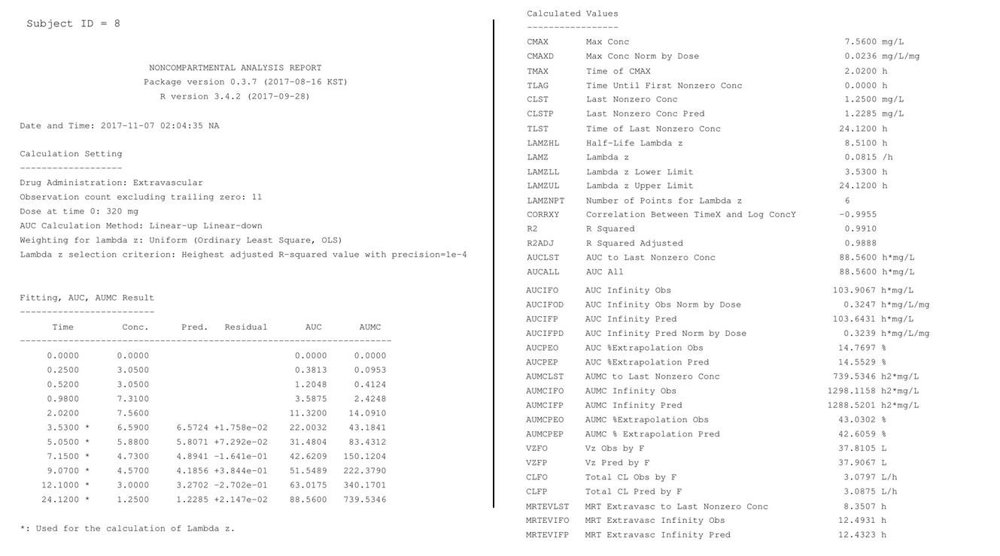

```{r setup, include = FALSE}
library(tidyverse)
library(NonCompart)
library(ncar)
library(pkr)
library(knitr)
opts_chunk$set(message = FALSE)
```

# Abstract 

WinNonlin is one of the widely used noncompartmental analysis (NCA) software. 
In this tutorial, we introduce a series of R packages, *NonCompart*, *ncar*, and *pkr* designed for noncompartmental analysis as closely as possible to the most widely used commercial software for pharmacokinetic analysis.
We demonstrated how accurately the results of the commercial software were reproduced and how easily the results, report, and plots can be obtained by this R packages. 

# Introduction

(Refer to Dr. Kim's manuscript)

# Methods

## Softwares

In this tutorial, we will use R 3.4.2 and it can be downloaded via CRAN (https://cran.r-project.com).
WinNonlin^®^ (Pharsight, Mountain View, CA, USA) under MS-Windows 7 (64 bit) was used for the comparison of calculated values.
The R packages can be installed and loaded by the scripts below. 

```r
install.packages('NonCompart', 'ncar', 'pkr')
library(NonCompart)
library(ncar)
library(pkr)
```

## Datasets

R itself contains two pharmacokinetic datasets, called Theoph and Indometh. 
In this tutorial we will use these datasets. (Figure \@ref(fig:ggtheoph))
In NCA R packages, the input dataset should be prepared as a long format as Theoph dataset shown in Table \@ref(tab:theophhead), and if a dataset is in a wide format, it can be easily converted using `gather()` function in *tidyr* package. 
Data preparation is one of the most important parts in accurate NCA process, therefore using trackable and reproducible code scripts like R, SAS, or python is highly recommended.
Using R for data preparation and NCA together will significantly reduce time and efforts for performing NCA.

```{r theophhead, echo = FALSE}
kable(head(Theoph, n=10), caption = 'Default Theoph dataset prepared in a long format')
```

```{r ggtheoph, fig.cap = 'Liniear concentration-time curves of oral administration of Theoph (N = 12)', fig.width = 6, fig.height = 8, echo = FALSE}
library(cowplot)
Theoph <- ggplot(Theoph, aes(Time, conc, group = Subject, color = Subject)) +
  background_grid(major = "xy", minor = "none") +
  geom_point(size = 4) + 
  geom_line(size = 1) +
  theme_bw() +
  labs(title = 'Oral Administration of Theoph (320 mg)',
       x = 'Time (hour)', y = 'Concentration (ng/mL)')

Indometh <- ggplot(Indometh, aes(time, conc, group = Subject, color = Subject)) +
  background_grid(major = "xy", minor = "none") +
  geom_point(size = 4) + 
  geom_line(size = 1) +
  theme_bw() +
  labs(title = 'Intravenous Administration of Indometh (mg)',
       x = 'Time (hour)', y = 'Concentration (ng/mL)')

plot_grid(Theoph, Indometh, labels = LETTERS[1:2], ncol = 1)
```

# Examples

## Calculation

A function `tblNCA()` of *NonCompart* package generates a simple table-format output of NCA with an attribute of units. 
`tblNCA()` contains several function arguments as shown below.

```r
tblNCA(concData, key = "Subject", 
       colTime = "Time", colConc = "conc", 
       dose = 0, adm = "Extravascular", 
       dur = 0, doseUnit = "mg", 
       timeUnit = "h", concUnit = "ug/L", 
       down = "Linear", MW = 0)
```

One can input several keys such as subject demographics, information regarding dose, period, or sequence and the result of `tblNCA()` will print the keys and the carried keys can be further used for additional statistical analysis (i.e. descriptive statistics, bioequivalence test, t-test or ANOVA). The `adm` argument can be 'Extravascular', 'Bolus', or 'Infusion'. The `down` argument can be 'Linear' or 'Log'.

<!-- To calculated tblNCA -->

<!-- ```r -->
<!-- tblNCA(Theoph, key="Subject", dose=320, concUnit="mg/L") -->
<!-- ``` -->

<!-- ```r -->
<!-- tblNCA(Indometh, key="Subject", colTime="time", colConc="conc", dose=25,  -->
<!--        adm="Infusion", dur=0.5, concUnit="mg/L") -->
<!-- ``` -->


## Reports

(Refer to Dr. Kim's manuscript)

## Plots

`plotPK()` function generates multiple files. (Figure \@ref(fig:pkr-vis))

```{r message = FALSE}
plotPK(Theoph, "Subject", "Time", "conc", unitTime="hr", unitConc="mg/L", dose=320)
```

<!-- ## Descriptive statistics -->

<!-- One thing we should keep in mind is that the output of `tblNCA()` is a character matrix so we probably want to change it to a data frame for the further manipulation and the PK parameters should be converted to numeric by `as.numeric()` to find descriptive statistics. -->

# Summary

A comparison of NCA metrics obtained by the ncar package and WinNonlin showed no discrepancies. 
The ncar package is a fast, easy-to-use and versatile tool-set written in R programming language that successfully perform NCA with the concentration-time data. 
This R package produces a comprehensive set of graphical and tabular output to summarize the NCA results, which is a complete report in PDF or RTF format. 
We hope that our newly-developed packages enable researchers to perform reliable and accurate NCA using R.


# Figures

```{r report, fig.cap = 'Example of ncar results (Subject ID 8) using Theoph data included in R programming. (A) rtf report, (B) plots (upper: linear scale, lower: log-linear scale)'}

```

```{r pkr-vis, fig.cap = 'Individual and group concerntration-time curves'}
include_graphics('assets/pkr.png')
```

# References

```{r}
write_bib(file = 'packages.bib')
```
