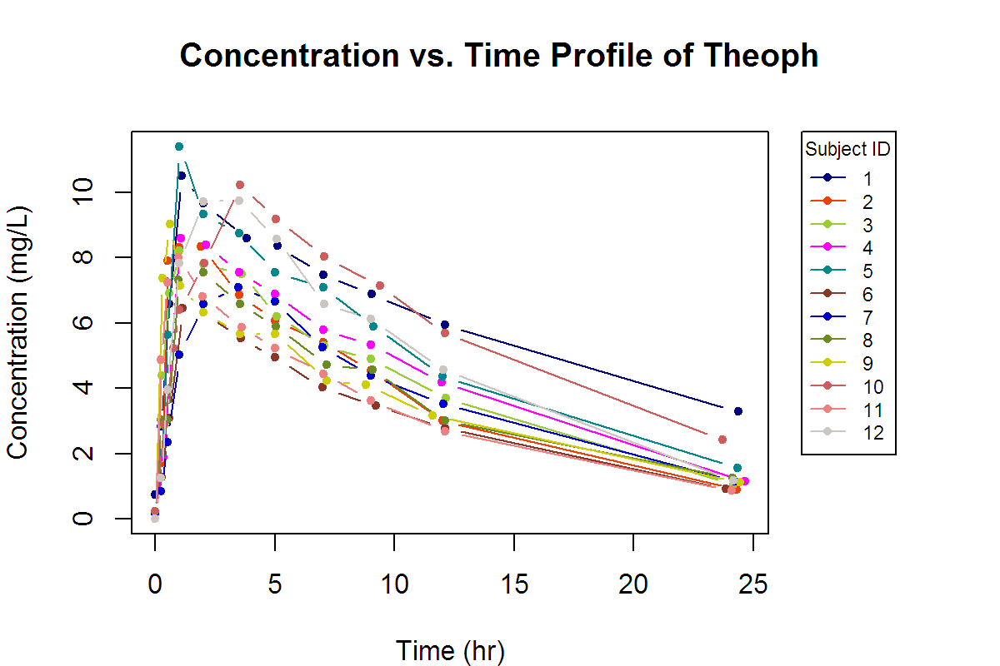
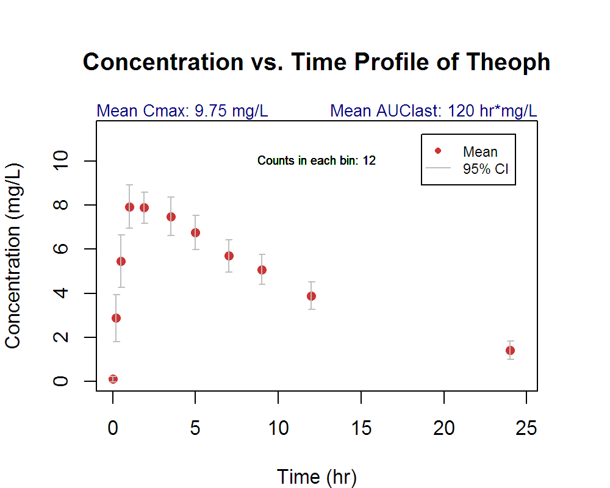
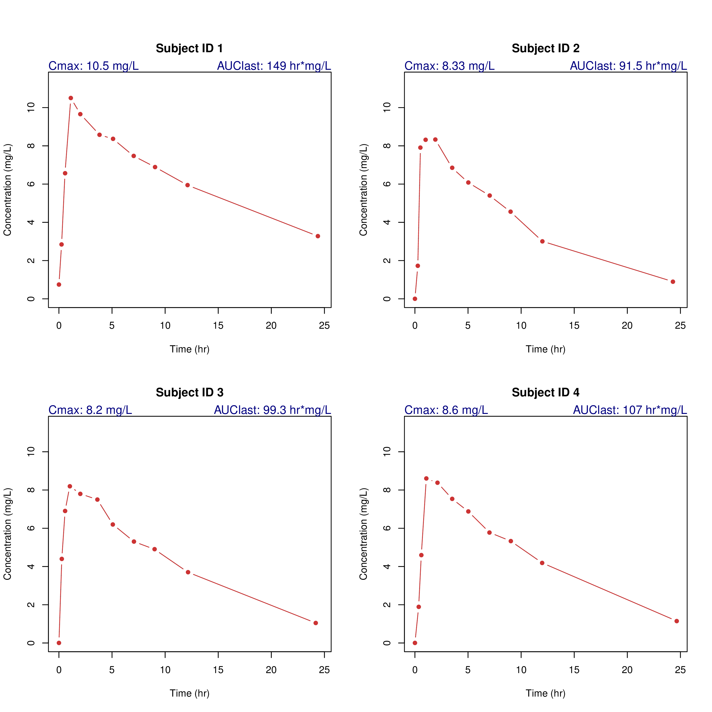

---
output: html_document
editor_options: 
  chunk_output_type: console
---

# R을 사용한 비구획분석 시각화 {#pkr}

## 이 장에서는 {#summary-pkr}

비구획분석에 대한 다양한 시각화는 여러 유용한 정보를 제공해 줍니다. 이를 가능하게 해 주는 `pkr` 패키지[@R-pkr]에 대해서  자세히 알아보겠습니다.

`pkr`의 `DESCRIPTION` 파일을 보면 다음과 같이 설명하고 있습니다.

> Conduct a noncompartmental analysis as closely as possible to the most widely used commercial software for pharmacokinetic analysis, i.e. 'Phoenix(R) WinNonlin(R)' <https://www.certara.com/software/pkpd-modeling-and-simulation/phoenix-winnonlin/>.
             Some features are
             1) CDISC SDTM terms
             2) Automatic slope selection with the same criterion of WinNonlin(R)
             3) Supporting both 'linear-up linear-down' and 'linear-up log-down' method
             4) Interval(partial) AUCs with 'linear' or 'log' interpolation method
             * Reference: Gabrielsson J, Weiner D. Pharmacokinetic and Pharmacodynamic Data Analysis - Concepts and Applications. 5th ed. 2016. (ISBN:9198299107).


```r
library(tidyverse)
library(pkr)
```

## pkr 사용법

`pkr` 함수의 가장 핵심적인 기능은 `plotPK()` 함수에 있고 이 함수의 인자는 다음과 같습니다.


```r
args(plotPK)
```

```
## function (concData, id, Time, conc, unitTime = "hr", unitConc = "ng/mL", 
##     trt = "", fit = "Linear", dose = 0, adm = "Extravascular", 
##     dur = 0, outdir = "Output") 
## NULL
```

`Theoph` 자료를 갖고 그림을 그리는 명령어를 실행해 보겠습니다.


```r
plotPK(Theoph, "Subject", "Time", "conc", unitTime="hr", unitConc="mg/L", dose=320)
```

```
## quartz_off_screen 
##                 2
```

조금 기다린 후 `Output` 폴더를 확인해 보면 세개의 그림 파일이 생성된 것을 알 수 있습니다.

- ./Output//PK Profile Linear Scale for Theoph.tiff
- ./Output//PK Profile Log 10 Scale for Theoph.tiff
- ./Output//PK Profile with CI for Theoph.tiff 


<div class="figure">

<p class="caption">(\#fig:unnamed-chunk-6)평균 약동학 파라메터와 그룹 농도-시간 그림 (선형)</p>
</div>

<div class="figure">

<p class="caption">(\#fig:unnamed-chunk-7)평균 약동학 파라메터와 그룹 농도-시간 그림 (로그)</p>
</div>

<div class="figure">

<p class="caption">(\#fig:unnamed-chunk-8)평균 약동학 파라메터와 그룹 평균 농도-시간 그림 (로그)</p>
</div>

또한 개개인 별로 여러개의 그림이 담긴 두개의 PDF 파일이 생성되었습니다.

- ./Output//Individual PK Linear Scale for Theoph.pdf
- ./Output//Individual PK Log 10 Scale for Theoph.pdf 


<div class="figure">

<p class="caption">(\#fig:unnamed-chunk-9)약동학 파라메터와 함께 표시되는 농도-시간 그림 (선형)</p>
</div>

<div class="figure">

<p class="caption">(\#fig:unnamed-chunk-10)약동학 파라메터와 함께 표시되는 농도-시간 그림 (로그)</p>
</div>
