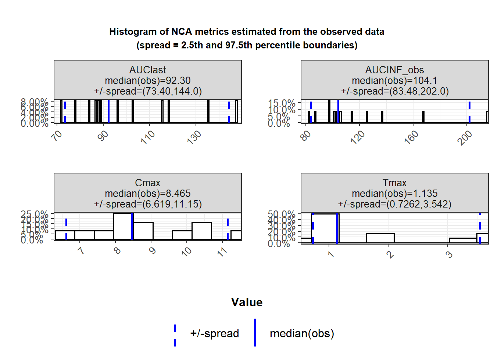

# 기타 비구획분석 소프트웨어 {#softwares}

## 이 장에서는 {#detailschapter}

이 장에서는 몇가지 NCA 용 소프트웨어(상용 소프웨어, R 패키지)를 비교하고 분석하여 그 결과와 사용법의 공통점과 차이점을 알아볼 것입니다.
특별히 Theoph 데이타셋에서 C~max~, AUC~inf~가 동일하게 나오는지 초점을 맞추어 실펴보겠습니다.


```r
library(tidyverse)
```

## Certara Phoenix WinNonLin

<https://www.certara.com/software/pkpd-modeling-and-simulation/phoenix-winnonlin/>

### Pros

- Validated for several years
- Industry standard
- Versatile unit setting
- Easy using by GUI 
- Generating plots supported

### Cons

- Expansive (~several thousand dollars)
- Not suitable for reproducible research
- CDISC SDTM not compatible (input and output)

## R package: PKNCA

Automation of Noncompartmental Analysis in R <https://github.com/billdenney/pknca>

### ISoP Pharmacometrics Study Group Presentation
* 강의 동영상 https://www.youtube.com/watch?v=WCmFrheYtcc
* 프로젝트 https://github.com/billdenney/pknca
* Package https://cran.r-project.org/web/packages/PKNCA/ 
    * 예제 R Markdown 파일 : https://github.com/billdenney/pknca/tree/master/vignettes
* PPT 파일 
* PKNCA 패키지란 무엇인가?  * Pharmacokinetic(PK) data를 위한 모든 noncompartmental analysis (NCA) 계산이 가능한 R용 패키지

```
library(devtools)
install_github("billdenney/pknca")
```

### 오픈소스 NCA - 지금이 적기이다.

* Data standards 가 점점 많아짐
* CDISC/SDTM가 FDA requirement
* CDISC ADaM working group is standardizing NCA data set (ADNCA) | 
    * CDISC SDTM pharmacokinetic concentration (PC) and pharmacokinetic parameter (PP) domains have been standardized 
* 우리도 R로 NCA?
    
    ### 할수 있는 것
    
    * Organizes concentration/time and dose/time data
* Predicts what you most likely need from NCA parameters from the concentration and dosing data.
* Allows user control of all NCA parameter and summary calculations
* Calculates all (standard) NCA parameters (Targeting the SDTM PK 파라메터)
* Summarizes the parameters 

### 한계 
* 그래픽 못그림
* 파라메터의 statistics 못구함 (곧 기능 추가할듯)

### PKNCA 현재는 0.7
* NCA 파라메터 계산가능 (Cmax, Tmax, AUClast, AUCinf, AUMC, half-life, …)
* NCA-related calculations (Superposition, Concentration interpolation/extrapolation (with AUC methods), Time to steady-state)
* SDTM PP-READY OUTPUT 가능
* 인풋에서 아웃풋까지 TRACK가능하다.
* 800개 넘는 테스트 케이스가 있음.

### PKNCA 곧 1.0이 나올것이다.
* Improved prediction of desired parameters (정확도 accuracy, number 등)

### 참고사항
* Github에서 모두 다운로드 가능
* CRAN에 package올라왔다. (0.7) https://cran.r-project.org/web/packages/PKNCA/ 
    * wdenney@humanpredictions.com 으로 메일 보내라
* 모든게 오픈이기 때문에 Github에서 기여 환영

### RStudio를 사용한 Hands-on 실습

#### Example-theophylline.Rmd

* Theophylline 농도를 가지고 PK Parameter 구하는 법
* https://raw.githubusercontent.com/billdenney/pknca/master/vignettes/Example-theophylline.Rmd 
* 이 파일을 RStudio에서 실행해본다.
* 이후 article에서 분석할 것입니다.

#### Superposition.Rmd

* https://raw.githubusercontent.com/billdenney/pknca/master/vignettes/Superposition.Rmd
* 이 파일을 RStudio에서 실행해본다.

### Closing
* PKNCA.options() 모든 옵션을 볼 수 있다.

### 결론
* 써보고 feedback주고 contribute해라.

### Pros

- Open source and free of charge
- CDISC SDTM semi compatible (output)
- Calculate partial(interval) AUC with 'linear' or 'log' interpolation method but in a cumbersome way

### Cons

- CDISC SDTM not compatible (input)
- More tests required
- Experience with R language required
- Generating plots not supported for now (To be supported soon)


```r
library(PKNCA)

my.conc <- PKNCAconc(as.data.frame(Theoph), conc~Time|Subject)
d.dose <- unique(datasets::Theoph[datasets::Theoph$Time == 0,
                                  c("Dose", "Time", "Subject")])
my.dose <- PKNCAdose(d.dose, Dose~Time|Subject)
my.data.automatic <- PKNCAdata(my.conc, my.dose)
my.results.automatic <- pk.nca(my.data.automatic)
my.results.automatic$result %>% filter(grepl(pattern = "cmax|aucinf", PPTESTCD)) %>% 
    arrange(PPTESTCD)
```

```
##    start end Subject   PPTESTCD   PPORRES exclude
## 1      0 Inf       1 aucinf.obs 214.92363    <NA>
## 2      0 Inf       2 aucinf.obs  97.37793    <NA>
## 3      0 Inf       3 aucinf.obs 106.12767    <NA>
## 4      0 Inf       4 aucinf.obs 114.21620    <NA>
## 5      0 Inf       5 aucinf.obs 136.30473    <NA>
## 6      0 Inf       6 aucinf.obs  82.17588    <NA>
## 7      0 Inf       7 aucinf.obs 100.98763    <NA>
## 8      0 Inf       8 aucinf.obs 102.15330    <NA>
## 9      0 Inf       9 aucinf.obs  97.52000    <NA>
## 10     0 Inf      10 aucinf.obs 167.86003    <NA>
## 11     0 Inf      11 aucinf.obs  86.90262    <NA>
## 12     0 Inf      12 aucinf.obs 125.83154    <NA>
## 13     0 Inf       1       cmax  10.50000    <NA>
## 14     0 Inf       2       cmax   8.33000    <NA>
## 15     0 Inf       3       cmax   8.20000    <NA>
## 16     0 Inf       4       cmax   8.60000    <NA>
## 17     0 Inf       5       cmax  11.40000    <NA>
## 18     0 Inf       6       cmax   6.44000    <NA>
## 19     0 Inf       7       cmax   7.09000    <NA>
## 20     0 Inf       8       cmax   7.56000    <NA>
## 21     0 Inf       9       cmax   9.03000    <NA>
## 22     0 Inf      10       cmax  10.21000    <NA>
## 23     0 Inf      11       cmax   8.00000    <NA>
## 24     0 Inf      12       cmax   9.75000    <NA>
```

```r
summary(my.results.automatic)
```

```
##   start end  N     auclast        cmax               tmax   half.life
## 1     0  24 12 74.6 [24.3]           .                  .           .
## 2     0 Inf 12           . 8.65 [17.0] 1.14 [0.630, 3.55] 8.18 [2.12]
##   aucinf.obs
## 1          .
## 2 115 [28.4]
```

## R package: ncappc

NCA Calculation and Population PK Model Diagnosis [@Acharya201683]

<https://cran.r-project.org/web/packages/ncappc/index.html>
<https://www.ncbi.nlm.nih.gov/pubmed/27000291>


```r
#install.packages("ncappc")
library(ncappc)
```


```r
Theoph %>% 
  rename(ID = Subject,
         TIME = Time,
         DV = conc) %>% 
  write_csv('Theoph_ncappc.csv')

Theoph_ncappc_results <- ncappc(obsFile = 'Theoph_ncappc.csv',
       onlyNCA = TRUE,
       extrapolate = TRUE,
       printOut = FALSE,
       evid = FALSE,
       psnOut=FALSE)
```



```r
Theoph_ncappc_results
```

```
## $ncaOutput
##    ID Dose C0 Tmax simTmax  Cmax simCmax Cmax_D Tlast Clast   AUClast
## 1   1   NA NA 1.12       0 10.50       0     NA 24.37  3.28 147.23475
## 2   2   NA NA 1.92       0  8.33       0     NA 24.30  0.90  88.73128
## 3   3   NA NA 1.02       0  8.20       0     NA 24.17  1.05  95.87820
## 4   4   NA NA 1.07       0  8.60       0     NA 24.65  1.15 102.63362
## 5   5   NA NA 1.00       0 11.40       0     NA 24.35  1.57 118.17935
## 6   6   NA NA 1.15       0  6.44       0     NA 23.85  0.92  71.69701
## 7   7   NA NA 3.48       0  7.09       0     NA 24.22  1.15  87.96923
## 8   8   NA NA 2.02       0  7.56       0     NA 24.12  1.25  86.80656
## 9   9   NA NA 0.63       0  9.03       0     NA 24.43  1.12  83.93744
## 10 10   NA NA 3.55       0 10.21       0     NA 23.70  2.42 135.57607
## 11 11   NA NA 0.98       0  8.00       0     NA 24.08  0.86  77.89347
## 12 12   NA NA 3.52       0  9.75       0     NA 24.15  1.17 115.22021
##    simAUClast  AUMClast simAUMClast   MRTlast No_points_Lambda_z
## 1           0 1499.1291           0 10.181897                  3
## 2           0  716.2787           0  8.072449                  4
## 3           0  810.8727           0  8.457321                  3
## 4           0  911.7828           0  8.883861                  3
## 5           0 1038.8800           0  8.790706                  4
## 6           0  618.6659           0  8.628894                  7
## 7           0  795.6268           0  9.044376                  4
## 8           0  756.3620           0  8.713189                  6
## 9           0  723.3794           0  8.618079                  3
## 10          0 1306.7406           0  9.638431                  3
## 11          0  626.6358           0  8.044779                  3
## 12          0  982.6343           0  8.528316                  3
##    AUClower_upper simAUClower_upper       Rsq Rsq_adjusted    Corr_XY
## 1       147.23475                 0 0.9999997    0.9999995 -0.9999999
## 2        88.73128                 0 0.9971954    0.9957931 -0.9985967
## 3        95.87820                 0 0.9993250    0.9986499 -0.9996624
## 4       102.63362                 0 0.9989241    0.9978483 -0.9994619
## 5       118.17935                 0 0.9986472    0.9979708 -0.9993234
## 6        71.69701                 0 0.9982413    0.9978896 -0.9991203
## 7        87.96923                 0 0.9986702    0.9980053 -0.9993349
## 8        86.80656                 0 0.9910124    0.9887655 -0.9954961
## 9        83.93744                 0 0.9994437    0.9988873 -0.9997218
## 10      135.57607                 0 0.9995087    0.9990174 -0.9997543
## 11       77.89347                 0 0.9999983    0.9999965 -0.9999991
## 12      115.22021                 0 0.9993968    0.9987936 -0.9996984
##      Lambda_z Lambda_z_lower Lambda_z_upper HL_Lambda_z simHL_Lambda_z
## 1  0.04845700             NA             NA   14.304378              0
## 2  0.10408644             NA             NA    6.659342              0
## 3  0.10244431             NA             NA    6.766087              0
## 4  0.09928702             NA             NA    6.981247              0
## 5  0.08661888             NA             NA    8.002264              0
## 6  0.08779574             NA             NA    7.894998              0
## 7  0.08833650             NA             NA    7.846668              0
## 8  0.08145054             NA             NA    8.510038              0
## 9  0.08245863             NA             NA    8.405999              0
## 10 0.07495982             NA             NA    9.246916              0
## 11 0.09545856             NA             NA    7.261237              0
## 12 0.11025949             NA             NA    6.286508              0
##    AUCINF_obs simAUCINF_obs AUCINF_D_obs AUC_pExtrap_obs AUC_pBack_Ext_obs
## 1   214.92363             0           NA       31.494388                NA
## 2    97.37793             0           NA        8.879485                NA
## 3   106.12767             0           NA        9.657680                NA
## 4   114.21620             0           NA       10.140927                NA
## 5   136.30473             0           NA       13.297688                NA
## 6    82.17588             0           NA       12.751756                NA
## 7   100.98763             0           NA       12.891086                NA
## 8   102.15330             0           NA       15.023241                NA
## 9    97.52000             0           NA       13.927981                NA
## 10  167.86003             0           NA       19.232667                NA
## 11   86.90262             0           NA       10.366943                NA
## 12  125.83154             0           NA        8.432966                NA
##    Vz_obs Cl_obs AUCINF_pred simAUCINF_pred AUCINF_D_pred AUC_pExtrap_pred
## 1      NA     NA   214.92665              0            NA        31.495352
## 2      NA     NA    97.26879              0            NA         8.777242
## 3      NA     NA   106.17742              0            NA         9.700011
## 4      NA     NA   114.28088              0            NA        10.191782
## 5      NA     NA   136.13958              0            NA        13.192512
## 6      NA     NA    82.41816              0            NA        13.008235
## 7      NA     NA   101.10897              0            NA        12.995629
## 8      NA     NA   101.88966              0            NA        14.803367
## 9      NA     NA    97.47735              0            NA        13.890321
## 10     NA     NA   167.77588              0            NA        19.192158
## 11     NA     NA    86.90059              0            NA        10.364854
## 12     NA     NA   125.88178              0            NA         8.469509
##    AUC_pBack_Ext_pred Vz_pred Cl_pred AUMCINF_obs AUMC_pExtrap_obs
## 1                  NA      NA      NA   4545.5928         67.02016
## 2                  NA      NA      NA   1009.4644         29.04369
## 3                  NA      NA      NA   1158.6516         30.01583
## 4                  NA      NA      NA   1313.9510         30.60755
## 5                  NA      NA      NA   1689.4873         38.50916
## 6                  NA      NA      NA    987.9420         37.37832
## 7                  NA      NA      NA   1258.3053         36.76997
## 8                  NA      NA      NA   1314.9431         42.47949
## 9                  NA      NA      NA   1219.9213         40.70278
## 10                 NA      NA      NA   2502.5540         47.78372
## 11                 NA      NA      NA    937.9535         33.19117
## 12                 NA      NA      NA   1335.1376         26.40202
##    AUMCINF_pred AUMC_pExtrap_pred MRTINF_obs MRTINF_pred Tau Tmin Cmin
## 1     4545.7288          67.02115   21.14980    21.15014  NA   NA   NA
## 2     1005.7637          28.78261   10.36646    10.34005  NA   NA   NA
## 3     1160.3397          30.11765   10.91753    10.92831  NA   NA   NA
## 4     1316.1967          30.72595   11.50407    11.51721  NA   NA   NA
## 5     1683.5593          38.29264   12.39493    12.36642  NA   NA   NA
## 6      996.4800          37.91487   12.02229    12.09054  NA   NA   NA
## 7     1262.6180          36.98595   12.45999    12.48769  NA   NA   NA
## 8     1305.3475          42.05666   12.87225    12.81138  NA   NA   NA
## 9     1218.3621          40.62690   12.50945    12.49893  NA   NA   NA
## 10    2499.4371          47.71860   14.90858    14.89748  NA   NA   NA
## 11     937.8835          33.18618   10.79316    10.79260  NA   NA   NA
## 12    1336.8064          26.49390   10.61052    10.61954  NA   NA   NA
##    Cavg AUCtau AUMCtau Clss Vss_obs Vss_pred p_Fluctuation
## 1    NA     NA      NA   NA      NA       NA            NA
## 2    NA     NA      NA   NA      NA       NA            NA
## 3    NA     NA      NA   NA      NA       NA            NA
## 4    NA     NA      NA   NA      NA       NA            NA
## 5    NA     NA      NA   NA      NA       NA            NA
## 6    NA     NA      NA   NA      NA       NA            NA
## 7    NA     NA      NA   NA      NA       NA            NA
## 8    NA     NA      NA   NA      NA       NA            NA
## 9    NA     NA      NA   NA      NA       NA            NA
## 10   NA     NA      NA   NA      NA       NA            NA
## 11   NA     NA      NA   NA      NA       NA            NA
## 12   NA     NA      NA   NA      NA       NA            NA
##    Accumulation_Index
## 1                  NA
## 2                  NA
## 3                  NA
## 4                  NA
## 5                  NA
## 6                  NA
## 7                  NA
## 8                  NA
## 9                  NA
## 10                 NA
## 11                 NA
## 12                 NA
```


```
## Error in file(file, "rt"): 커넥션을 열 수 없습니다
```

```
## Error in eval(expr, envir, enclos): 객체 'Theoph_ncappc'를 찾을 수 없습니다
```

## R package: PK

Basic Non-Compartmental Pharmacokinetics

<https://cran.r-project.org/web/packages/PK/index.html>


```r
#install.packages("PK")
library(PK)
```

## Kinetica

## Scientist

## PKSolver

## Summary


```
## Error in file(file, "rt"): 커넥션을 열 수 없습니다
```


