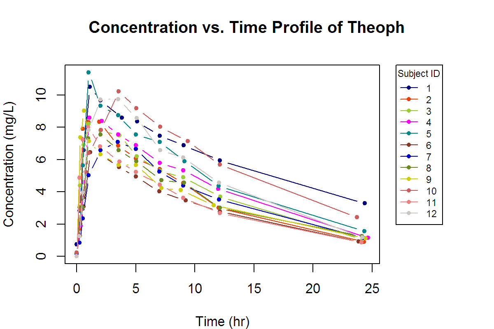
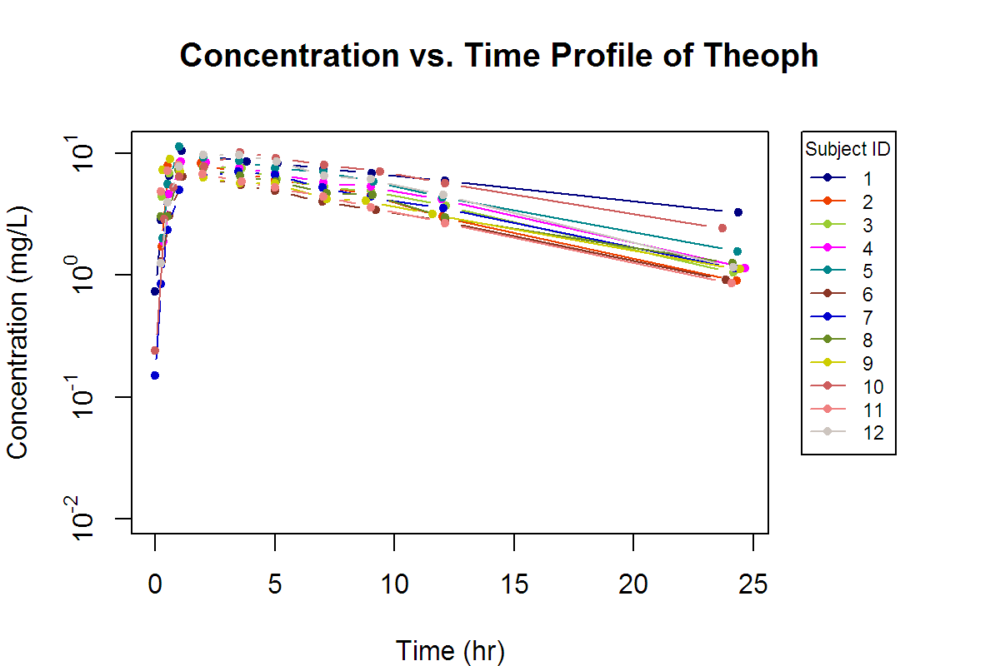
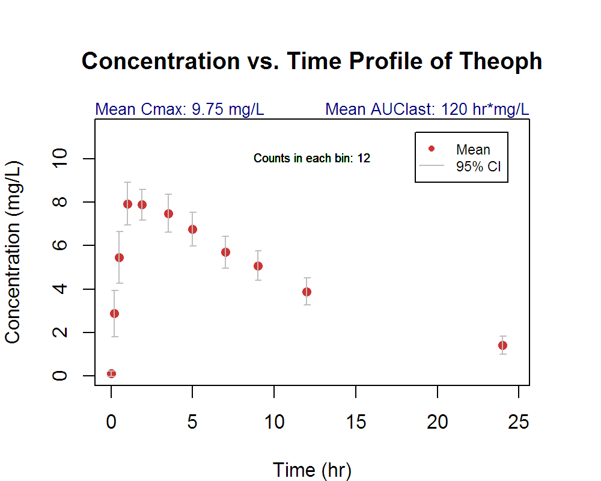
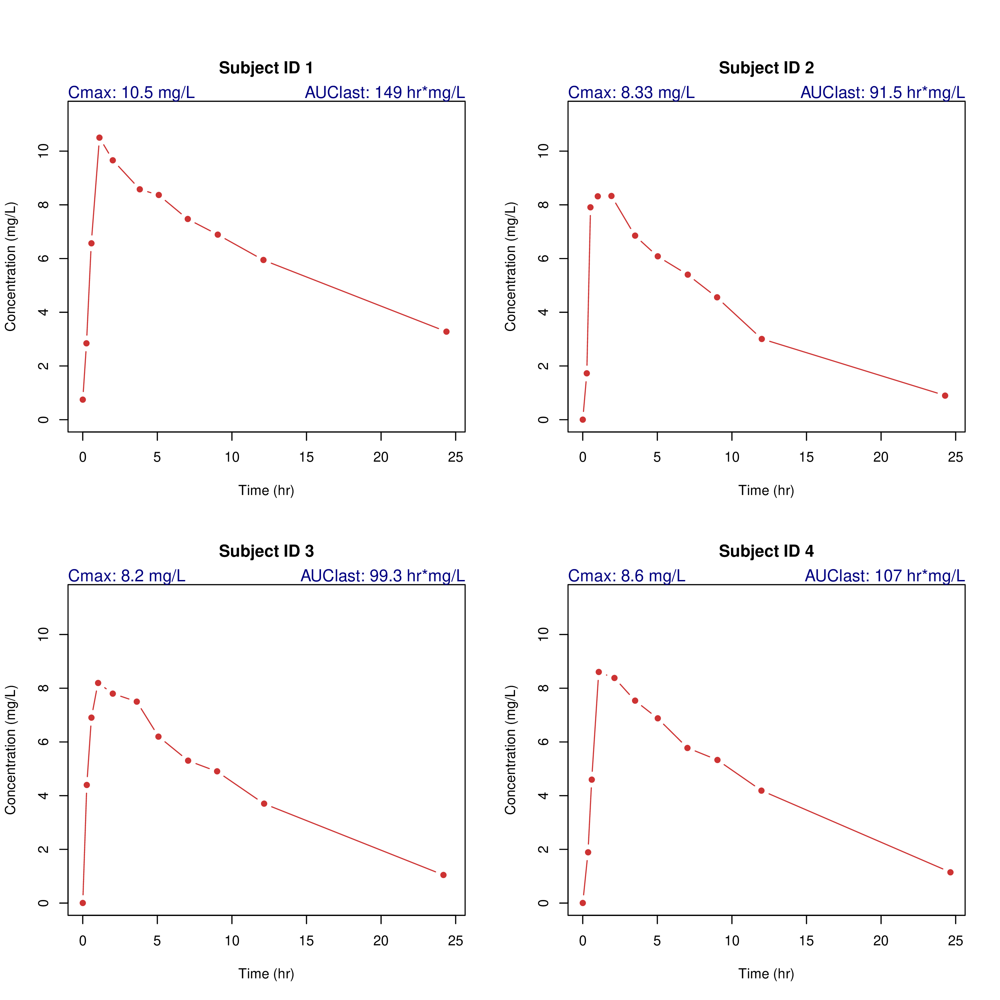

# R을 사용한 비구획분석 시각화 {#pkr}

## 이 장에서는 {#summary-pkr}

NCA에 대한 다양한 시각화를 가능하게 해 주는 `pkr` 패키지 [@R-pkr] 에 대해 알아보겠습니다.

```{r, message = FALSE}
library(pkr)
library(tidyverse)
```

## pkr 사용법

`pkr` 함수의 가장 핵심적인 기능은 `plotPK()` 함수에 있고 이 함수의 인자는 다음과 같습니다.

```{r}
args(plotPK)
```

```{r message = FALSE}
plotPK(Theoph, "Subject", "Time", "conc", unitTime="hr", unitConc="mg/L", dose=320)
```

예제를 돌려보면 여러 그림이 생성됩니다.

`r dir('./Output/') %>% grep(pattern = 'tiff', value = TRUE) %>% paste(collapse = ', ')` 의 세개의 그림 파일이 생성된 것을 알 수 있습니다.
`r dir('./Output/') %>% grep(pattern = 'pdf', value = TRUE) %>% paste(collapse = ', ')` 의 또한 두개의 그림 파일이 생성되었습니다.











